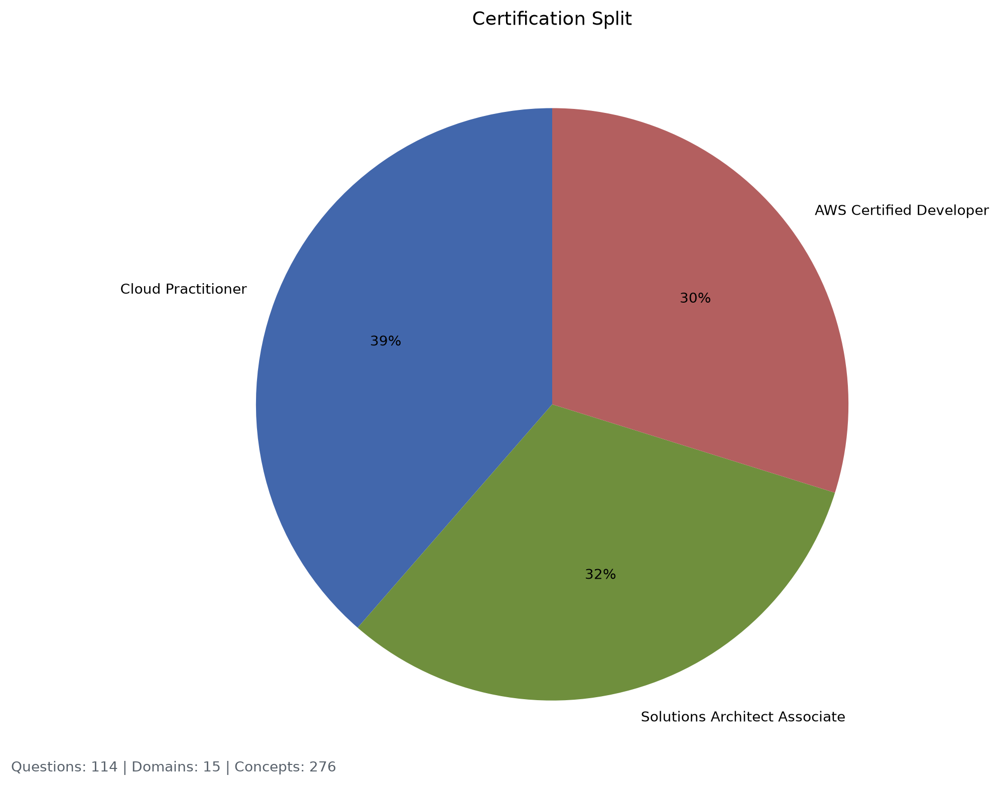
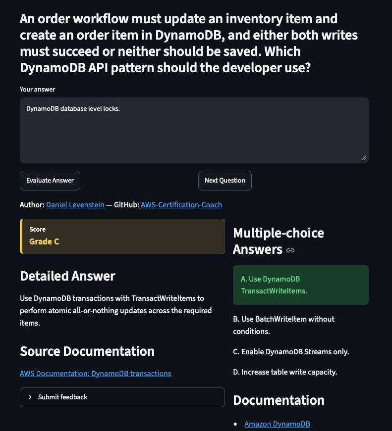
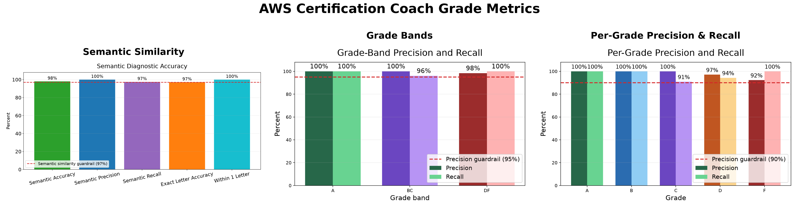

# AWS Certification Coach

AI study partner for AWS certification exams.



*Figure: Shows test exam breakdown for project.*

## Live Demo

The latest version of this project is deployed live on Render.

- Render Deployment: [AWS Certification Coach](https://aws-certification-coach-latest.onrender.com/)

## Application Screenshot



*Figure: The coach scores a freeform Amazon answer and displays detailed feedback alongside the source multiple-choice question.*

## Goal

AWS Certification Coach is a lightweight study app for AWS certification practice. It presents pre-generated freeform questions, evaluates learner answers with the local `semantic_similarity` model by default, and returns structured coaching feedback.

This version intentionally removes the runtime RAG stack from the earlier prototype. There is no document ingestion, FAISS index, vector database, or embedding model in the deployed app. Certification content is generated and reviewed offline, then served from a simple question repository.

## Question Data Generation

The app question bank is generated offline from self-authored, exam-style AWS scenarios. The project does not copy real exam dumps, paid practice-test text, or restricted AWS Skill Builder content. AWS exam guides and documentation are used as style and scope references, while the local artifacts are generated specifically for this project.

The generation flow starts with `config/knowledge_base/knowledge_base.json` for canonical service, source URL, concept, and scenario facts, applies reusable mechanics from `config/question_templates/question_template.json`, and uses `config/answer_rubric/answer_rubric.json` for learner-answer rubric defaults. `scripts/generate_app_question_artifacts.py` renders 160 app-facing questions by default, then the Developer Associate generator appends its reviewed set.

Each generated question keeps its source-style multiple-choice item in the same JSON row under `original_multiple_choice`. Curated answer feedback and the structured knowledge-base seed remain separate from the app question bank.

`config/knowledge_base/knowledge_base.json` is committed curated configuration, not an auto-generated artifact. `./setup.sh` and the question generators read scoring and question sources but do not rewrite the knowledge base. Make manual knowledge-base changes in `config/knowledge_base/` and commit them; generated local outputs live under `data/` and release metrics under `metrics/`.

Artifacts keep letter grades for readability. Curated release metrics compare the three grade bands `A/B`, `C`, and `D/F`.



### To regenerate local data:

```bash
./setup.sh
```

## Releases

The schema redesign branch starts the v3 release line. Use `v3.1.x` for new releases from this branch forward so earlier `v3.0.x` and `v3.0.0` space remains available for any future migration/backfill tags. Historical v1 and v2 release numbers are intentionally left as-is.


| Release | Description                                                                                        |
|---------|----------------------------------------------------------------------------------------------------|
| v1.0.0  | Initial Streamlit/Docker release with generated AWS certification practice questions..             |
| v1.1.0  | Separated the app-facing question bank from training labels.                                       |
| v1.3.1  | Test framework redesign; initial curated grade-band accuracy was 44%.                              |
| v1.3.4  | Swapped default app scoring to`semantic_similarity`; curated grade-band accuracy reached 80%.      |
| v1.5.3  | Updated test data to have proper train, test, validation split                                     |
| v1.5.4  | Made`semantic_similarity` the official model name, moved release gating to 80% semantic precision. |
| v2.1.1  | Added AWS Developer Certification practice questions                                               |
| v2.3.6  | Improved answer evaluation model and added within one letter grade metric to release notes         |
| v2.4.5  | Got exact letter accuracy metric over 87%                                                          |
| v3.1.4  | Heuristic grading improvement                                                                      |
| v3.2.1  | Added Semantic Similarity chart back                                                               |
| v3.2.3  | Updated per letter grade screenshots.                                                              |
| v3.3.4 | Setting the best wrong answer back to D in answer rubric. |
#### Scope

Certifications:

- Cloud Practitioner
- Solutions Architect Associate
- AWS Developer Exam

Difficulty:

- Easy
- Medium

## Previous Application

This project was inspired by my previous AWS Documentation RAG project.

- v0 GitHub:  [DanielLevenstein/AWS-Documentation-Rag](https://github.com/DanielLevenstein/AWS-Documentation-Rag)

## Setup

Create the virtual environment, install dependencies, and generate local data:

```bash
./setup.sh
```

Start the local MongoDB service with Docker Compose:

```bash
docker compose up -d mongodb
```

Recreate the local database from the committed raw JSON files:

```bash
docker compose run --rm migrate
```

For local Python development outside Compose, the recreate helper defaults to
`mongodb://localhost:27017` and database `aws_certification_coach`:

```bash
./recreate_database.sh
```

Override those values when needed:

```bash
MONGODB_URI="mongodb://localhost:27017" AWS_COACH_MONGODB_DATABASE="aws_certification_coach" ./recreate_database.sh
```

Then run the app:

```bash
./run_app.sh
```

When `MONGODB_URI` is set, the application loads migrated knowledge-base and
question-template content from MongoDB. Set `AWS_COACH_CONTENT_BACKEND=json` to
force the legacy JSON-backed content path during development.

### Application Tests and Release Notes

Run the fast unit and contract tests:

```bash
./run_unit_tests.sh
```

Run the read-only model smoke checks during routine development:

```bash
./run_model_smoke_tests.sh
```

Tests are grouped by review area under `tests/application`, `tests/artifacts`, `tests/evaluation`, `tests/knowledge`, `tests/question_quality`, and `tests/release`. The explicit `tests/model_smoke` and `tests/deployment` directories are run only by their corresponding wrappers.

Run deployment health checks against an already-built image:

```bash
DOCKER_IMAGE=aws-certification-coach:latest ./run_deployment_tests.sh
```

Run the release suite and save the latest release chart artifacts:
Refresh semantic metrics, curated diagnostics, knowledge metrics, and tagged charts:

```bash
MONGODB_URI="mongodb://localhost:27017" AWS_COACH_MONGODB_DATABASE="aws_certification_coach" ./release_notes.sh --full v3.1.0
```

Full release metrics use the migrated `generated_questions` MongoDB collection.
Set `AWS_COACH_CONTENT_BACKEND=json` only when intentionally measuring the
legacy JSON artifact.

Refresh release-note Markdown and chart copies from the latest completed full metrics run without rerunning tests:

```bash
./release_notes.sh --quick v3.1.0
```

Set `RELEASE_METRICS_DIR=metrics/<timestamp>` to reuse a specific full run. Quick mode fails when the selected directory is incomplete instead of silently retraining.

The release helper saves the `semantic_similarity` diagnostic chart, separate question coverage charts for domain, intent, and certification split, plus combined accuracy and question-coverage charts as latest-only files in `release/`.

The pandas/Matplotlib graphs are written to a timestamped root-level `metrics/<timestamp>/` directory.

Summary artifiacts are copied to the release directory and saved with `$tag_name` in front of the file name.

### Regenerate Questions Locally

Regenerate the 160-question default bank plus reviewed Developer Associate questions:

```bash
.venv/bin/python scripts/generate_app_question_artifacts.py
.venv/bin/python scripts/generate_developer_question_artifacts.py --app-output data/questions/sample_questions.json
```

The application and release pipeline use the deterministic `semantic_similarity` evaluator backed by the local knowledge base and curated feedback. There is no answer-regressor training workflow.

Print a single release-note-friendly model performance summary:

```bash
.venv/bin/python scripts/release_metrics.py
```

## Docker

Use Docker Compose for the local app and database stack:

```bash
docker compose up -d mongodb
docker compose run --rm migrate
docker compose up --build app
```

The app is available at `http://localhost:8501`.

Build the app image directly when you only need the app container:

```bash
docker build -t aws-certification-coach:latest .
```

Run the app container directly against a local MongoDB service:

```bash
docker run --rm -p 8501:8501 \
  -e MONGODB_URI="mongodb://host.docker.internal:27017" \
  -e AWS_COACH_MONGODB_DATABASE="aws_certification_coach" \
  aws-certification-coach:latest
```

The image includes generated sample questions and local scoring code. MongoDB is
required for the migrated content database path and should be available before
deploying the app service.

## Render Deployment

- Runtime: Docker
- Port: use Render's `PORT` environment variable; the container defaults to `8501` for local runs.
- Health check path: `/_stcore/health`
- Default evaluator: local `semantic_similarity` scoring
- API key requirement: none for the default local path.
- Database: configure a MongoDB service separately and set `MONGODB_URI` plus
  `AWS_COACH_MONGODB_DATABASE` for the app service. The deploy helper fails
  when `MONGODB_URI` is not set so the app image is not pushed as a database-less
  deployment by accident.
- Database image: `deploy.sh` publishes a MongoDB image tag before pushing the
  app image. It defaults to retagging `mongo:7` into
  `daniellevenstein/aws-certification-coach-mongodb:<tag>`. Override with
  `DATABASE_IMAGE` or `DATABASE_IMAGE_REPOSITORY` when needed.

## Evaluator Configuration

The `semantic_similarity` scorer recognizes canonical service aliases, concept coverage, incorrect answer choices, and simple answer/reference overlap.
