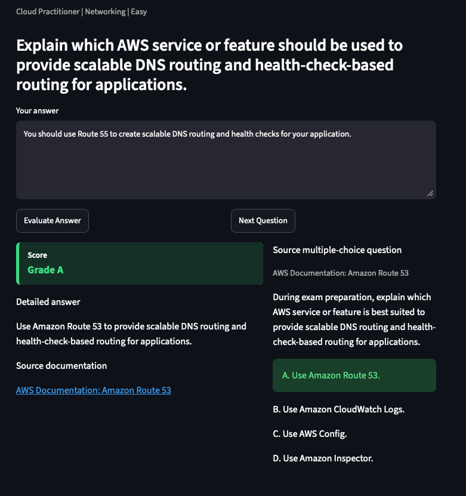

# AWS-Certification-Coach

AI study partner for AWS certification exams



*Figure: The coach scores a freeform Amazon Kinesis answer and displays detailed feedback alongside the source multiple-choice question.*

## Goal

AWS Certification Coach is a lightweight AI-powered study app for AWS certification practice. It presents pre-generated questions, evaluates learner answers with the trained local classifier or a configured LLM provider, and returns structured coaching feedback.

This project was based on a previous project called AWS-Documentation-Rag.
This version intentionally removes the runtime RAG stack from the earlier prototype.
There is no document ingestion, FAISS index, vector database, or embedding model in the deployed app.

Certification content is generated and reviewed offline, then served from a simple question repository.

### UX Flow

1. The learner opens the Streamlit app.
2. The learner selects certification, domain, and difficulty filters.
3. The app starts or resets a `QuizSession`.
4. The app displays the current `Question`.
5. The learner submits a free-text answer.
6. `EvaluationService` builds a prompt with `EvaluationPromptBuilder`.
7. The selected evaluator provider returns JSON feedback.
8. `EvaluationResponseParser` converts the response into an `EvaluationResult`.
9. The UI displays the result and records an `AnsweredQuestion`.
10. The learner advances to the next question until the filtered set is complete.

## Training Data Generation

The V1 training data is generated offline from self-authored, exam-style AWS scenarios. The project does not copy real exam dumps, paid practice-test text, or restricted AWS Skill Builder content. AWS exam guides and documentation are used as style and scope references, while the local artifacts are generated specifically for this project.

The generation flow starts with service-level scenario specs in `scripts/generate_sample_training_artifacts.py`. Each spec defines the target AWS service or feature, certification, domain, difficulty, expected purpose, key concepts, and plausible distractors. The script turns those specs into original multiple-choice questions, then converts them into freeform recall prompts so learners must explain the answer instead of recognizing it from choices.

Each generated question keeps its source-style multiple-choice item in the same JSON row under `original_multiple_choice`. The same row also stores answer examples used for model training:

- `generated_answers`: complete, partial, weak, and incorrect answers labeled with human-readable grades `A`, `B`, `C`, `D`, and `F`.

Training and verification data are generated separately:

- `data/generated/questions_with_answers_generated.json`: generated training artifact used by the classifier and partial-credit regressor.
- `data/generated/user_feedback.v1.json`: learner-submitted grade corrections created by the app using the self-contained v1 schema.
- `data/curated/curated_training_data.json`: reviewed feedback examples maintained by hand.
- `data/curated/user_feedback.v1.json`: reviewed learner submissions included in model training.
- `data/verification/questions_with_answers_holdout.json`: holdout artifact reserved for final verification and not used by training scripts.
- `data/questions/sample_questions.json`: app-facing question bank generated independently of training labels and grounded with AWS documentation source URLs.

Artifacts keep letter grades for readability. Dataset loaders convert them in memory to numeric regression targets and binary labels, with `C` and above treated as passing. Both training scripts also incorporate curated feedback and any locally submitted user feedback when those files exist.

To regenerate the artifacts cleanly:

```bash
rm -rf data models
python scripts/generate_sample_training_artifacts.py
python scripts/generate_app_question_artifacts.py --count 80
python scripts/train_answer_classifier.py --min-accuracy 0.90
python scripts/train_partial_answer_regressor.py
```

## Releases

| Release | Description                                                                                                                                                                 |
| ------- | --------------------------------------------------------------------------------------------------------------------------------------------------------------------------- |
| v1.1.0  | Separates the app-facing question bank from training labels,<br /> expands the app bank to 80 AWS-docs-grounded questions and adds stricter wrong-service answer rejection. |
| v1.0.0  | Initial Streamlit/Docker release with generated AWS certification practice questions, <br />trained answer classifier, and partial-credit regression metrics.               |

#### ```Scope

Certifications:

- Cloud Practitioner
- Solutions Architect Associate

Domains:

- Analytics
- Application Integration
- Billing
- Compute
- Database
- Governance
- Integration
- Networking
- Operations
- Resilient Architectures
- Security
- Storage

Difficulty:

- Easy
- Medium

## Setup

Install the project in editable mode so the `src/` package imports work from Streamlit, tests, and command-line scripts:

```bash
python3 -m pip install -e .
```

Then run the app:

```bash
streamlit run app.py
```

Run tests:

```bash
pytest
```

Regenerate local training, holdout, and app sample artifacts:

```bash
python scripts/generate_sample_training_artifacts.py
python scripts/generate_app_question_artifacts.py --count 80
```

Train the deployed answer classifier and enforce the 90% minimum gate:

```bash
python scripts/train_answer_classifier.py --min-accuracy 0.90
```

The default training command uses `data/generated/questions_with_answers_generated.json`, which contains 100 self-authored freeform questions, original multiple-choice provenance, and generated answers spanning grades A through F.

Train the partial-credit regression model and report mean squared error:

```bash
python scripts/train_partial_answer_regressor.py
```

Print a single release-note-friendly model performance summary:

```bash
python scripts/release_metrics.py
```

Final verification data is stored separately in `data/verification/questions_with_answers_holdout.json`. Do not use that file for training.

Use the trained classifier in the app:

```bash
streamlit run app.py
```

## Docker

Build the container image:

```bash
docker build -t aws-certification-coach:latest .
```

Run the app on port 8501:

```bash
docker run --rm -p 8501:8501 aws-certification-coach:latest
```

The image includes the generated sample questions and trained model artifacts, so the default app path runs without an API key.

## Render Deployment

- Runtime: Docker
- Port: use Render's `PORT` environment variable; the container defaults to `8501` for local runs.
- Health check path: `/_stcore/health`
- Default evaluator: `trained_classifier`
- API key requirement: none for the default classifier path; set `OPENAI_API_KEY` only when using the OpenAI provider.

## Evaluator Configuration

V1 defaults to the trained classifier evaluator after `models/answer_classifier.json` has been generated.

For LLM-based evaluation, use OpenAI with the configured default model:

```bash
export AWS_COACH_EVALUATOR_PROVIDER=openai
export OPENAI_API_KEY=...
streamlit run app.py
```

The recommended starting model is `gpt-5.4-mini` because answer grading needs reliable instruction following and useful feedback, but not the full cost of the flagship model for every response. Use `gpt-5.5` when evaluation quality matters more than latency or cost.

Provider, model, and hyperparameters are configured in `config/evaluator_default.json`. Common overrides:

```bash
export AWS_COACH_OPENAI_MODEL=gpt-5.5
export AWS_COACH_OPENAI_TEMPERATURE=0
export AWS_COACH_OPENAI_MAX_OUTPUT_TOKENS=1200
export AWS_COACH_OPENAI_REASONING_EFFORT=medium
```

## Question Transformation

Source multiple-choice artifacts may live in `data/questions/source_multiple_choice_*.json`. Transformed and generated app artifacts preserve the original MCQ under `original_multiple_choice`. The generated training and holdout files keep each freeform question and its answer examples together in one combined JSON row.

Run the offline transformer with a stronger model:

```bash
python scripts/transform_questions.py \
  --input data/questions/source_multiple_choice_sample.json \
  --output data/questions/transformed_freeform_sample.json \
  --provider openai \
  --model gpt-5.4
```

For local smoke tests without API calls:

```bash
python scripts/transform_questions.py \
  --input data/questions/source_multiple_choice_sample.json \
  --output /tmp/transformed_freeform_sample.json \
  --provider heuristic
```
