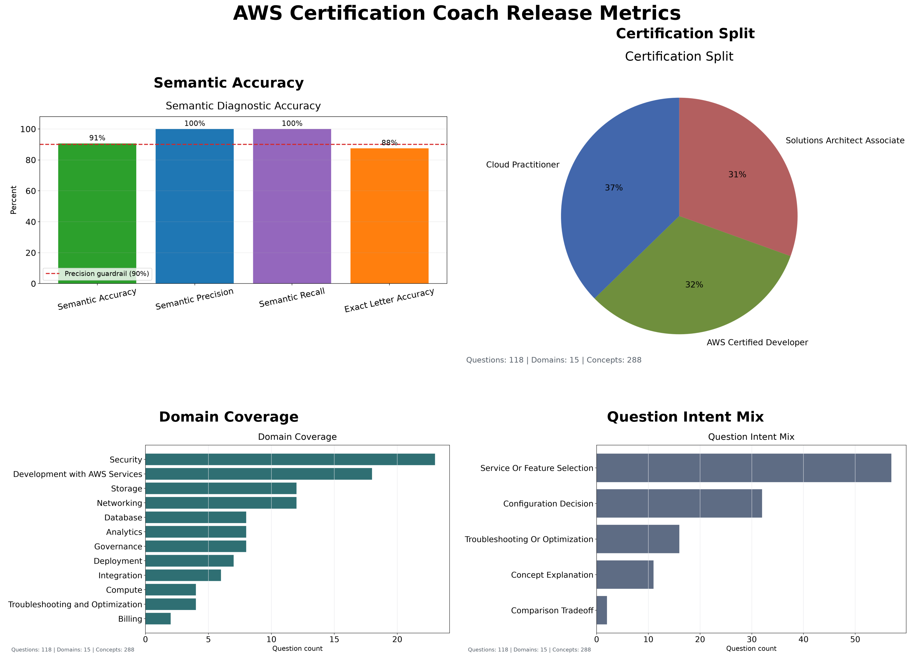

# Release Notes

| Release  | Description                                                                                                                        |
|:---------|:-----------------------------------------------------------------------------------------------------------------------------------|
| v1.0.0   | Initial Streamlit/Docker release with generated AWS certification practice questions.                                              |
| v1.3.4   | Swaps app scoring from trained regression to`semantic_similarity`.                                                                 |
| v2.1.1   | Adds Developer Associate freeform question generation and independent question-fidelity scoring.                                   |
| v2.1.2   | Expands the Developer source set to 12 rows, generates 12 Developer questions, and adds v2 feedback text capture.                  |
| v2.2.4   | Stabilizes answer grading against the standardized rubric and moves Training Accuracy out of the maintained release metrics table. |
| v2.3.1   | Adds the app-facing answer rubric data contract, generated exact-letter grade examples, and strict grading release metrics flag.   |
| v2.3.4   | Added a syntax alias list to improve model accuracy                                                                                |
| v2.4.1   | Adds the first Phase 2 artifact-review question iteration for IAM, Lambda, SDK, and SAM review.                                    |
| v2.4.4.1 | Updated feedback file to show 1 digit schema version rather than 2                                                                 |
| v2.4.5   | Ensure that full sentence answers which reference the correct service receive grade A                                              |
| v2.4.5.2 | Added contact info to app                                                                                                          |
| v2.4.5.4 | Updated TODO.md to check off tasks which are finished and moved existing content to PHASE_1_ROADMAP.md                             |
| v2.4.6   | Clean up release notes  and documentation                                                                                          |
| V2.4.5.5 | Updated RELEASE_NOTES.md to show metric definitions|
| v2.5.0   | Defined A-C as the correct answer and D-F as incorrect in metrics. |
| v2.5.1   | implemented reimplemented per-grade performance evaluation for semantic accuracy model.| 
# Release Metrics

## Metric Definitions:

- “Semantic Accuracy” was a grade-band agreement: A/B, C/D, or F.
- Versions below v2.5 and below treat A–D as accepted and F as rejected;
- Versions 2.5+ treat A–C as accepted and D/F as failing.
- Exact Letter required the identical A/B/C/D/F class.
- Within one Letter used the ordered scale A → B → C → D → F.

## Semantic Accuracy
| Release  | Semantic Accuracy | Semantic Precision | Semantic Recall | Exact Letter Accuracy | Within 1 Letter | Question Fidelity |
|:---------|------------------:|-------------------:|----------------:|----------------------:|----------------:|------------------:|
| v1.5.0   |            68.00% |             84.62% |          68.75% |               Unknown |         Unknown |           Unknown |
| v1.5.4   |            68.00% |             84.62% |          68.75% |               Unknown |         Unknown |           Unknown |
| v2.1.1   |            68.00% |             84.62% |          68.75% |               Unknown |         Unknown |            96.80% |
| v2.1.2   |            83.33% |             90.00% |          90.00% |               Unknown |         Unknown |            96.00% |
| v2.2.4   |           Unknown |             94.44% |          94.44% |                64.00% |         Unknown |            95.12% |
| v2.3.1   |            86.21% |             95.45% |          95.45% |                55.17% |         Unknown |            95.12% |
| v2.3.2   |            86.21% |             95.45% |          95.45% |                55.17% |         Unknown |            95.12% |
| v2.3.3   |            88.46% |             94.74% |          94.74% |                61.54% |         Unknown |            94.95% |
| v2.3.4   |            82.35% |             96.00% |          88.89% |                55.88% |         Unknown |            94.95% |
| v2.3.5   |            86.84% |             96.55% |          90.32% |                57.89% |         Unknown |            94.95% |
| v2.3.6   |            83.33% |             88.24% |          93.75% |                57.14% |          94.23% |            95.12% |
| v2.3.6.1 |            91.18% |            100.00% |          92.59% |                67.65% |          99.04% |            95.12% |
| v2.3.6.2 |            91.18% |            100.00% |          92.59% |                67.65% |          99.04% |            95.12% |
| v2.3.6.3 |            91.18% |            100.00% |          92.59% |                67.65% |          97.12% |            95.12% |
| v2.4.2   |            76.47% |             96.00% |          88.89% |                47.06% |         Unknown |            94.95% |
| v2.4.3   |            90.91% |            100.00% |          92.31% |                66.67% |          97.12% |            94.95% |
| v2.4.4   |            90.00% |            100.00% |          90.00% |                73.33% |          98.08% |            94.95% |
| v2.4.4.1 |            90.00% |            100.00% |          90.00% |                73.33% |          98.08% |            94.95% |
| v2.4.5   |            90.62% |            100.00% |          90.91% |                87.50% |          98.08% |            94.95% |
| v2.4.6   | 90.62% | 100.00% | 90.91% | 87.50% | 98.08% | 94.95% |
| v2.5.2   | 90.62% | 100.00% | 100.00% | 87.50% | 98.08% | 94.95% |
For v2.1.1, the answer-scoring metrics are expected to match v1.5.4 because the generated answer benchmark and curated answer benchmark did not change. The regenerated Developer Associate question expansion is measured by the new Question Fidelity metric.

For v2.1.2, generated Developer Associate source questions remove multiple-choice-only instructions from freeform prompts. The Developer Associate source metadata expanded from 5 to 12 source rows and now produces 12 generated Developer questions in the app question set. Feedback submissions now capture the expected letter grade plus optional freeform grader context, and supplemental generated feedback rows cover question-rephrasing answers.
Developer questions use `AWS Certified Developer` as the display certification label and keep `DVA-C02` as internal exam-code metadata.

For v2.1.1 - v2.1.2,
I noticed a huge update to Semantic Accuracy and Semantic Recall after the latest update, but Training Accuracy is still in the 60s.
Also, I am worried about why Saved Accuracy is so much higher than Semantic Accuracy.

For v2.2.0 design planning, comparison-style freeform questions should ask learners to explain why the best service or feature beats the strongest near-miss distractor. The design is documented in [V2_2_ENHANCED_SERVICES_COMPARISON_DESIGN.md](docs/PHASE_1_ENHANCED_SERVICES_COMPARISON_DESIGN.md). The release metrics run now generates domain, intent, and certification question coverage charts for the release notes.

For v2.2.4 and later, the maintained release metrics table is `Release`, `Semantic Accuracy`, `Semantic Precision`, `Semantic Recall`, `Exact Letter Accuracy`, `Within 1 Letter`, and `Question Fidelity`.

`Training Accuracy` and `Saved Accuracy` have been removed from the release table because they no longer reflect the actual heuristic used in the app. `Semantic Accuracy` uses grade-band agreement, while `Exact Letter Accuracy` reports strict A/B/C/D/F agreement.

For v2.3.1, generated question artifacts now include `question_type`, rubric concept metadata, acceptable answers, misconception notes, and `must_not_claim` guardrails. 
The held-out exact-letter grade dataset is generated from the test split for rubric verification.

For v2.3.2 the strict-grading parameter was deprecated and a new column added for `Exact Letter Accuracy`. Exact-letter accuracy is below the 90% precision guardrail because several curated A/B/C boundary cases are intentionally counted as strict calibration misses.

For v2.3.6, `Within 1 Letter` comes from `scripts/evaluate_answer_model.py` and reports the generated answer model test split. It accepts adjacent `A/B/C/D/F` predictions while `Exact Letter Accuracy` still requires the exact expected letter.

For v2.4.1, the first Phase 2 implementation adds generated `artifact_review` questions for IAM policy review, Lambda code review, SDK pagination review, and SAM template permission review. The app now preserves artifact metadata and renders self-authored code/configuration snippets in the learner question flow.

## Current Coverage

<!-- release-metrics:start -->
## Generated Release Metrics

| Release | Semantic Accuracy | Semantic Precision | Semantic Recall | Exact Letter Accuracy | Within 1 Letter | Question Fidelity |
|:--------|------------------:|-------------------:|----------------:|----------------------:|----------------:|------------------:|
| v2.5.3 | 90.62% | 100.00% | 100.00% | 87.50% | 98.08% | 94.95% |

## Per Grade Metrics

| Metric | A | B | C | D | F |
|:-------|--:|--:|--:|--:|--:|
| Precision | 46.51% | 50.00% | 35.71% | 100.00% | 85.71% |
| Recall | 83.33% | 21.88% | 62.50% | 31.25% | 100.00% |
| F1 | 59.70% | 30.43% | 45.45% | 47.62% | 92.31% |
| Support | 24 | 32 | 8 | 16 | 24 |

Saved model answer form: `long`
Saved model calibration count: `25`
Question fidelity model: `question_fidelity_heuristic_v1`
Developer source question count: `38`
App question count: `118`
Question coverage domain count: `15`
Question coverage concept count: `288`
Question coverage intent count: `5`
Top covered concepts: `rules, least privilege, Amazon S3, cost optimization, Amazon RDS, replication, low latency, serverless, health checks, Secrets Manager, AWS Organizations, SCPs`
Semantic evaluation count: `32`
Semantic Accuracy uses grade-band agreement (`A/B`, `C/D`, or `F`).
Exact Letter Accuracy requires exact `A`, `B`, `C`, `D`, or `F` agreement.
Within 1 Letter uses the ordered `A`, `B`, `C`, `D`, `F` scale.
Semantic Precision and Recall treat `A`–`C` as accepted and `D`/`F` as failing.
Question fidelity is the release guardrail for generated-question concept and exam-style fidelity.

## Answer Model Split Evaluation

| Split | Examples | Within 1 Letter | Exact Letter | MAE | MSE |
|---|---:|---:|---:|---:|---:|
| Train | 312 | 98.4% | 63.8% | 0.0569 | 0.0052 |
| Validation | 104 | 100.0% | 73.1% | 0.0470 | 0.0034 |
| Test | 104 | 98.1% | 58.7% | 0.0572 | 0.0053 |
<!-- release-metrics:end -->
