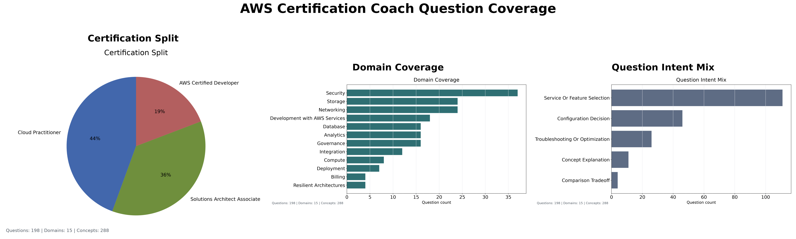

# Release Notes

| Release  | Description                                                                                                                        |
|:---------|:-----------------------------------------------------------------------------------------------------------------------------------|
| v1.0.0   | Initial Streamlit/Docker release with generated AWS certification practice questions.                                              |
| v1.3.4   | Swaps app scoring from trained regression to`semantic_similarity`.                                                                 |
| v2.1.1   | Adds Developer Associate freeform question generation and independent question-fidelity scoring.                                   |
| v2.1.2   | Expands the Developer source set to 12 rows, generates 12 Developer questions, and adds v2 feedback text capture.                  |
| v2.2.4   | Stabilizes answer grading against the standardized rubric and moves Training Accuracy out of the maintained release metrics table. |
| v2.3.1   | Adds the app-facing answer rubric data contract, generated exact-letter grade examples, and strict grading release metrics flag.   |
| v2.3.4   | Added a syntax alias list to improve model accuracy                                                                                |
| v2.4.1   | Adds the first Phase 2 artifact-review question iteration for IAM, Lambda, SDK, and SAM review.                                    |
| v2.4.4.1 | Updated feedback file to show 1 digit schema version rather than 2                                                                 |
| v2.4.5   | Ensure that full sentence answers which reference the correct service receive grade A                                              |
| v2.4.5.2 | Added contact info to app                                                                                                          |
| v2.4.5.4 | Updated TODO.md to check off tasks which are finished and moved existing content to PHASE_1_ROADMAP.md                             |
| v2.4.6   | Clean up release notes and documentation                                                                                           |
| V2.4.5.5 | Updated RELEASE_NOTES.md to show metric definitions                                                                                |
| v2.5.1   | Reimplemented per-grade performance evaluation for semantic accuracy model.                                                        | 
| v2.5.2   | Restored the legacy Semantic Precision and Recall definition.                                                                      |
| v2.5.4   | Added new grading band chart with bands defined as A, BC, and DF                                                                   |
| v2.5.5   | Added back exact match and off by one graph for release metrics.                                                                   |
| v2.6.1   | Adds the first structured AWS knowledge base with deterministic classifier access and bounded lightweight-model context.           |
| v2.6.2   | Splits model smoke and full-training gates, groups tests by review area, and isolates deployment checks.                           |
| v2.6.3   | Makes quick release-note generation reuse validated full-run metrics without retraining or rerunning tests.                        |
| v2.6.3.1 | Fixed deployment tests |
| v2.6.4   | Removes the unused answer regressor and generated split workflow, moves all release grading metrics to semantic evaluation, and expands the default question bank to 160 questions. |
# Release Metrics

## Metric Definitions:

- “Semantic Accuracy” was a grade-band agreement: A/B, C/D, or F.
- Semantic Precision and Recall retain the legacy definition: A–D are accepted and F is rejected.
- Exact Letter required the identical A/B/C/D/F class.
- Within one Letter used the ordered scale A → B → C → D → F.

## Semantic Accuracy
| Release  | Semantic Accuracy | Semantic Precision | Semantic Recall | Exact Letter Accuracy | Within 1 Letter | Question Fidelity |
|:---------|------------------:|-------------------:|----------------:|----------------------:|----------------:|------------------:|
| v1.5.0   |            68.00% |             84.62% |          68.75% |               Unknown |         Unknown |           Unknown |
| v1.5.4   |            68.00% |             84.62% |          68.75% |               Unknown |         Unknown |           Unknown |
| v2.1.1   |            68.00% |             84.62% |          68.75% |               Unknown |         Unknown |            96.80% |
| v2.1.2   |            83.33% |             90.00% |          90.00% |               Unknown |         Unknown |            96.00% |
| v2.2.4   |           Unknown |             94.44% |          94.44% |                64.00% |         Unknown |            95.12% |
| v2.3.1   |            86.21% |             95.45% |          95.45% |                55.17% |         Unknown |            95.12% |
| v2.3.2   |            86.21% |             95.45% |          95.45% |                55.17% |         Unknown |            95.12% |
| v2.3.3   |            88.46% |             94.74% |          94.74% |                61.54% |         Unknown |            94.95% |
| v2.3.4   |            82.35% |             96.00% |          88.89% |                55.88% |         Unknown |            94.95% |
| v2.3.5   |            86.84% |             96.55% |          90.32% |                57.89% |         Unknown |            94.95% |
| v2.3.6   |            83.33% |             88.24% |          93.75% |                57.14% |          94.23% |            95.12% |
| v2.3.6.1 |            91.18% |            100.00% |          92.59% |                67.65% |          99.04% |            95.12% |
| v2.3.6.2 |            91.18% |            100.00% |          92.59% |                67.65% |          99.04% |            95.12% |
| v2.3.6.3 |            91.18% |            100.00% |          92.59% |                67.65% |          97.12% |            95.12% |
| v2.4.2   |            76.47% |             96.00% |          88.89% |                47.06% |         Unknown |            94.95% |
| v2.4.3   |            90.91% |            100.00% |          92.31% |                66.67% |          97.12% |            94.95% |
| v2.4.4   |            90.00% |            100.00% |          90.00% |                73.33% |          98.08% |            94.95% |
| v2.4.4.1 |            90.00% |            100.00% |          90.00% |                73.33% |          98.08% |            94.95% |
| v2.4.5   |            90.62% |            100.00% |          90.91% |                87.50% |          98.08% |            94.95% |
| v2.4.6   |            90.62% |            100.00% |          90.91% |                87.50% |          98.08% |            94.95% |
| v2.5.2   |            90.62% |            100.00% |          90.91% |                87.50% |          98.08% |            94.95% |
| v2.6.3   |            90.62% |            100.00% |          90.91% |                87.50% |          96.15% |            94.95% |

## Grade Band Precision
| Release |      A |    B&C |     D&F |
|:--------|-------:|-------:|--------:|
| v2.5.5  | 46.51% | 60.71% | 100.00% |
| v2.6.1  | 50.00% | 69.70% | 100.00% |
| v2.6.4  | 90.00% | 100.00% | 100.00% |

## Grade Precision
| Release |      A |      B |      C |       D |      F |
|:--------|-------:|-------:|-------:|--------:|-------:|
| v2.5.5  | 46.51% | 50.00% | 35.71% | 100.00% | 85.71% |
| v2.6.1  | 50.00% | 70.59% | 50.00% | 100.00% | 85.71% |
| v2.6.3  | 50.00% | 70.59% | 50.00% | 100.00% | 85.71% |
| v2.6.4  | 90.00% | 66.67% | N/A | 100.00% | 83.33% |

For v2.1.1, the answer-scoring metrics are expected to match v1.5.4 because the generated answer benchmark and curated answer benchmark did not change. The regenerated Developer Associate question expansion is measured by the new Question Fidelity metric.

For v2.1.2, generated Developer Associate source questions remove multiple-choice-only instructions from freeform prompts. The Developer Associate source metadata expanded from 5 to 12 source rows and now produces 12 generated Developer questions in the app question set. Feedback submissions now capture the expected letter grade plus optional freeform grader context, and supplemental generated feedback rows cover question-rephrasing answers.
Developer questions use `AWS Certified Developer` as the display certification label and keep `DVA-C02` as internal exam-code metadata.

For v2.1.1 - v2.1.2,
I noticed a huge update to Semantic Accuracy and Semantic Recall after the latest update, but Training Accuracy is still in the 60s.
Also, I am worried about why Saved Accuracy is so much higher than Semantic Accuracy.

For v2.2.0 design planning, comparison-style freeform questions should ask learners to explain why the best service or feature beats the strongest near-miss distractor. The design is documented in [V2_2_ENHANCED_SERVICES_COMPARISON_DESIGN.md](docs/PHASE_1_ENHANCED_SERVICES_COMPARISON_DESIGN.md). The release metrics run now generates domain, intent, and certification question coverage charts for the release notes.

For v2.2.4 and later, the maintained release metrics table is `Release`, `Semantic Accuracy`, `Semantic Precision`, `Semantic Recall`, `Exact Letter Accuracy`, `Within 1 Letter`, and `Question Fidelity`.

`Training Accuracy` and `Saved Accuracy` have been removed from the release table because they no longer reflect the actual heuristic used in the app. `Semantic Accuracy` uses grade-band agreement, while `Exact Letter Accuracy` reports strict A/B/C/D/F agreement.

For v2.3.1, generated question artifacts now include `question_type`, rubric concept metadata, acceptable answers, misconception notes, and `must_not_claim` guardrails. 
The held-out exact-letter grade dataset is generated from the test split for rubric verification.

For v2.3.2 the strict-grading parameter was deprecated and a new column added for `Exact Letter Accuracy`. Exact-letter accuracy is below the 90% precision guardrail because several curated A/B/C boundary cases are intentionally counted as strict calibration misses.

For v2.3.6, `Within 1 Letter` comes from `scripts/evaluate_answer_model.py` and reports the generated answer model test split. It accepts adjacent `A/B/C/D/F` predictions while `Exact Letter Accuracy` still requires the exact expected letter.

For v2.4.1, the first Phase 2 implementation adds generated `artifact_review` questions for IAM policy review, Lambda code review, SDK pagination review, and SAM template permission review. The app now preserves artifact metadata and renders self-authored code/configuration snippets in the learner question flow.

For v2.6.1, answer evaluation loads a validated 13,214-byte local knowledge document containing 18 syntax aliases, 16 service families, and natural-language descriptions for all 27 concepts in the structured answer-training seed. Semantic grade-band accuracy, precision, recall, and exact-letter accuracy remain unchanged from the previous release baseline. The retrained regressor reports 96.15% test within-one-letter accuracy and 67.31% test exact-letter accuracy; exact-answer calibration removal remains deferred to a later knowledge-base iteration.

For v2.6.2, routine model smoke checks are read-only and complete without training, while full held-out model training and candidate-artifact generation have separate documented commands. Tests are grouped into review-oriented directories with no loose root-level test modules. Unit tests exclude model-smoke and deployment directories, the existing Docker/HTTP guardrail runs through its own deployment suite, and full release-note generation performs only one release-training pass. The ambiguous `run_model_tests.sh` wrapper was removed, and Playwright remains a documented later iteration. Model and release metrics are unchanged from v2.knowledgeBase1.1.

For v2.6.3, `release_notes.sh --quick` validates and reuses the latest completed full metrics directory, or the directory selected through `RELEASE_METRICS_DIR`. It performs no model training, evaluation, coverage, unit, or smoke run. The verified quick refresh completed in 1.57 seconds and preserved the v2.knowledgeBase1.2 metrics.

## Current Coverage

<!-- release-metrics:start -->
## Generated Release Metrics

| Release | Legacy Semantic Accuracy | Semantic Precision | Semantic Recall | Exact Letter Accuracy | Within 1 Letter | Question Fidelity |
|:--------|------------------:|-------------------:|----------------:|----------------------:|----------------:|------------------:|
| v2.6.4 | 90.62% | 100.00% | 90.91% | 87.50% | 100.00% | 94.95% |

## Grade Band Metrics

| Metric | A | BC | DF |
|:-------|--:|---:|---:|
| Precision | 90.00% | 100.00% | 100.00% |
| Recall | 100.00% | 75.00% | 100.00% |
| F1 | 94.74% | 85.71% | 100.00% |
| Support | 9 | 4 | 19 |

## Per Grade Metrics

| Metric | A | B | C | D | F |
|:-------|--:|--:|--:|--:|--:|
| Precision | 90.00% | 66.67% | N/A | 100.00% | 83.33% |
| Recall | 100.00% | 66.67% | 0.00% | 77.78% | 100.00% |
| F1 | 94.74% | 66.67% | N/A | 87.50% | 90.91% |
| Support | 9 | 3 | 1 | 9 | 10 |

Answer evaluator: `semantic_similarity` with the local knowledge base
Question fidelity model: `question_fidelity_heuristic_v1`
Developer source question count: `38`
App question count: `198`
Question coverage domain count: `15`
Question coverage concept count: `288`
Question coverage intent count: `5`
Top covered concepts: `rules, Amazon S3, cost optimization, Amazon RDS, replication, low latency, serverless, health checks, AWS Organizations, SCPs, least privilege, Secrets Manager`
Knowledge base schema version: `1`
Knowledge base file size: `13348` bytes
Knowledge base syntax alias count: `18`
Knowledge base service family count: `16`
Knowledge base concept count: `27`
Semantic evaluation count: `32`
Grade-band reporting uses the exclusive `A`, `BC`, and `DF` groups from `BandAccuracy`.
Exact Letter Accuracy requires exact `A`, `B`, `C`, `D`, or `F` agreement.
Within 1 Letter uses the ordered `A`, `B`, `C`, `D`, `F` scale.
Legacy Semantic Precision and Recall retain the original `A`–`D` accepted and `F` rejected definition.
Question fidelity is the release guardrail for generated-question concept and exam-style fidelity.
<!-- release-metrics:end -->
