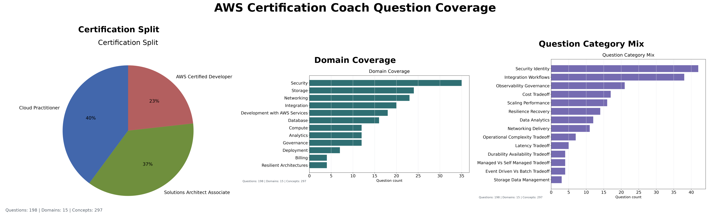

# Release Notes

- Release notes are generated by running `./release_notes.sh --full $RELEASE_TAG`
- Release versions in Docker and GitHub should match, but not all builds are tagged. 
- Release notes are summarized for readability, and some version numbers may be lost in the summarization. 

| Release  | Description                                                                                                                             |
|:---------|:----------------------------------------------------------------------------------------------------------------------------------------|
| v1.0.0   | Initial Streamlit/Docker release with generated AWS certification practice questions.                                                   |
| v1.3.4   | Swaps app scoring from trained regression to`semantic_similarity`.                                                                      |
| v2.1.1   | Adds Developer Associate freeform question generation and independent question-fidelity scoring.                                        |
| v2.1.2   | Expands the Developer source set to 12 rows, generates 12 Developer questions, and adds v2 feedback text capture.                       |
| v2.2.4   | Stabilizes answer grading against the standardized rubric and moves Training Accuracy out of the maintained release metrics table.      |
| v2.3.1   | Adds the app-facing answer rubric data contract, generated exact-letter grade examples, and strict grading release metrics flag.        |
| v2.4.1   | Adds the first Phase 2 artifact-review question iteration for IAM, Lambda, SDK, and SAM review.                                         |
| v2.4.5   | Ensure that full sentence answers which reference the correct service receive grade A                                                   |
| v2.5.1   | Reimplemented per-grade performance evaluation for semantic accuracy model.                                                             |
| v2.5.4   | Added new grading band chart with bands defined as A, BC, and DF                                                                        |
| v3.0.1   | Adds the first structured AWS knowledge base with deterministic classifier access and bounded lightweight-model context.                |
| v3.0.2   | Splits model smoke and full-training gates, groups tests by review area, and isolates deployment checks.                                |
| v3.0.3   | Makes quick release-note generation reuse validated full-run metrics without retraining or rerunning tests.                             |
| v3.0.4   | Removes the unused answer regressor and generated split workflow, moves all release grading metrics to semantic evaluation.             |
| v3.1.1   | Split question and knowledge base schema (knowledge_base and question_template.json)                                                    |
| v3.1.2   | Added documentation links for all services and displayed suggested_improvements in UI                                                   |
| v3.3.4   | Setting the best wrong answer back to D in answer rubric.                                                                               |
| v3.4.1   | Moving literal constants out of generate_developer_question_artifacts.py and into question_template.json                                |
| v3.4.2   | Update feedback explanations for wrong service selection                                                                                |
| v3.6.0   | Added question_category taxonomy coverage to generated app questions.                                                                   |
| v3.6.1   | Added Show Option selections to UI, Grade tuning based on user feedback.                                                                |
| v3.6.4   | Generate common_misconceptions and must_not_claim fields during question generation time.                                               |
| v3.7.0   | Increase test data so there is a more even number of example cases for each grade level.                                                |
| v3.7.1   | Updated curated_training_balanced_grade_examples.json based on performance.                                                             |
| v3.7.2   | Removed Duplicate D grades from training data.                                                                                          |
| v3.7.3   | Revert v3.6.4 Generate common_misconceptions and must_not_claim fields during question generation time.                                 |
| v3.7.3.1 | Removed references to certification-coach scenarios from the AWS knowledge base and expanded descriptions to be more than one sentence. |
| v3.7.3.2 | Changed grade for correct service wrong description to B.                                                                               |
| v3.8.1   | Tunes semantic scoring for strong AWS concept prose so latest release metrics clear guardrails.                                         |
# Release Metrics

## Metric Definitions:

- “Semantic Accuracy” was a grade-band agreement: A/B, C/D, or F.
- "Semantic Precision" and "Semantic Recall" define A–D are accepted and F is rejected.

## Semantic Accuracy

| Release  | Semantic Accuracy | Semantic Precision | Semantic Recall | Exact Letter Accuracy | Within 1 Letter | Question Fidelity |
|:---------|------------------:|-------------------:|----------------:|----------------------:|----------------:|------------------:|
| v1.5.0   |            68.00% |             84.62% |          68.75% |               Unknown |         Unknown |           Unknown |
| v2.1.2   |            83.33% |             90.00% |          90.00% |               Unknown |         Unknown |            96.00% |
| v2.3.1   |            86.21% |             95.45% |          95.45% |                55.17% |         Unknown |            95.12% |
| v2.3.2   |            86.21% |             95.45% |          95.45% |                55.17% |         Unknown |            95.12% |
| v2.3.3   |            88.46% |             94.74% |          94.74% |                61.54% |         Unknown |            94.95% |
| v2.3.4   |            82.35% |             96.00% |          88.89% |                55.88% |         Unknown |            94.95% |
| v2.3.5   |            86.84% |             96.55% |          90.32% |                57.89% |         Unknown |            94.95% |
| v2.3.6   |            83.33% |             88.24% |          93.75% |                57.14% |          94.23% |            95.12% |
| v2.3.6.3 |            91.18% |            100.00% |          92.59% |                67.65% |          97.12% |            95.12% |
| v2.4.2   |            76.47% |             96.00% |          88.89% |                47.06% |         Unknown |            94.95% |
| v3.1.4   |            97.89% |            100.00% |          99.12% |                97.47% |          99.16% |            94.95% |
| v3.1.4.3 |            99.16% |            100.00% |          99.12% |                98.73% |         100.00% |            94.95% |
| v3.2.2   |            99.16% |            100.00% |          99.12% |                98.73% |         100.00% |            94.95% |
| v3.3.2   |            96.79% |             98.33% |          98.74% |                94.38% |          97.99% |            94.95% |
| v3.4.1   |            99.20% |            100.00% |          99.17% |                98.80% |         100.00% |            94.95% |
| v3.5.2   |            98.39% |            100.00% |          99.17% |                97.19% |          99.20% |            94.95% |
| v3.6.1   |            98.39% |            100.00% |          99.17% |                97.19% |          99.20% |            95.12% |
| v3.6.3   |            98.39% |            100.00% |          99.17% |                97.19% |          99.20% |            95.12% |
| v3.6.4   |            98.39% |            100.00% |          99.17% |                97.19% |          99.20% |            95.12% |
| v3.7.0   |            95.92% |            100.00% |          97.09% |                92.18% |          97.28% |            95.12% |
| v3.7.1   |            98.64% |            100.00% |          99.26% |                97.28% |          99.32% |            95.12% |
| v3.7.2   |            97.00% |            100.00% |          97.37% |                95.00% |          99.00% |            95.12% |
| v3.8.0   |            94.17% |            100.00% |          97.47% |                92.23% |          96.12% |            95.12% |
| v3.8.1   |            98.06% |            100.00% |          97.47% |                97.09% |         100.00% |            95.12% |

## Grading Rubric:

| Grade | Description                                                                           |
|-------|---------------------------------------------------------------------------------------|
| A     | Answers that name the correct service and provide a full-sentence explanation.        |
| B     | Answers that name the correct service as a one or two-word answer.                    |
| C     | Answers which describe pieces of the problem but do not specify the service involved. |
| D     | Answers which name the best wrong answer.                                             |
| F     | Answers which have no relation to the correct answer.                                 |

### Grade Band Precision
| Release |       A |     B&C |     D&F |
| :------ | ------: | ------: | ------: |
| v2.5.5  |  46.51% |  60.71% | 100.00% |
| v3.0.1  |  50.00% |  69.70% | 100.00% |
| v3.0.4  |  90.00% | 100.00% | 100.00% |
| v3.3.0  |  90.00% |  84.62% |  97.79% |
| v3.3.1  |  92.31% |  64.71% |  98.17% |
| v3.3.2  |  92.31% |  64.71% |  98.17% |
| v3.3.4  | 100.00% |  92.31% | 100.00% |
| v3.4.1  | 100.00% |  92.31% | 100.00% |
| v3.5.2  | 100.00% |  90.00% |  98.25% |
| v3.7.0  | 94.44% | 95.65% | 93.28% |
| v3.7.1  | 100.00% | 95.65% | 98.02% |
| v3.7.2  | 100.00% | 96.00% | 96.72% |
| v3.8.0  | 100.00% | 88.89% | 95.16% |
| v3.8.1  | 100.00% | 100.00% | 98.33% |

## Grade Precision
| Release  |       A |      B |       C |        D |      F |
|:---------|--------:|-------:|--------:|---------:|-------:|
| v2.5.5   |  46.51% | 50.00% |  35.71% |  100.00% | 85.71% |
| v3.0.1   |  50.00% | 70.59% |  50.00% |  100.00% | 85.71% |
| v3.0.3   |  50.00% | 70.59% |  50.00% |  100.00% | 85.71% |
| v3.0.4   |  90.00% | 66.67% |     N/A |  100.00% | 83.33% |
| v3.1.1   |  90.91% | 75.00% | 100.00% |  100.00% | 84.62% |
| v3.1.4.1 |  76.92% | 75.00% | 100.00% |  100.00% | 84.62% |
| v3.1.4.2 | 100.00% | 66.67% | 100.00% |  100.00% | 84.62% |
| v3.1.4.3 | 100.00% | 80.00% | 100.00% |  100.00% | 84.62% |
| v3.2.2   | 100.00% | 80.00% | 100.00% |  100.00% | 84.62% |
| v3.3.0   |  90.00% | 71.43% |  83.33% |   98.10% | 68.75% |
| v3.3.1   |  92.31% | 83.33% |  54.55% |   98.09% | 70.00% |
| v3.3.2   |  92.31% | 83.33% |  54.55% |   98.09% | 70.00% |
| v3.3.4   | 100.00% | 83.33% | 100.00% |  100.00% | 77.78% |
| v3.4.1   | 100.00% | 83.33% | 100.00% |  100.00% | 77.78% |
| v3.4.2   | 100.00% | 80.00% | 100.00% | 98.17%   | 77.78% |
| v3.7.0   | 94.44% | 93.75% | 71.43% | 95.13% | 70.37% |
| v3.7.1   | 100.00% | 93.75% | 100.00% | 97.79% | 92.59% |
| v3.7.2   | 100.00% | 93.33% | 100.00% | 94.29% | 92.31% |
| v3.8.0  | 100.00% | 93.33% | 83.33% | 91.67% | 92.31% |
| v3.8.1  | 100.00% | 100.00% | 100.00% | 97.06% | 92.31% |

## Current Coverage

<!-- release-metrics:start -->
## Generated Release Metrics

| Release | Semantic Accuracy | Semantic Precision | Semantic Recall | Exact Letter Accuracy | Within 1 Letter | Question Fidelity |
|:--------|------------------:|-------------------:|----------------:|----------------------:|----------------:|------------------:|
| v3.8.1 | 98.06% | 100.00% | 97.47% | 97.09% | 100.00% | 95.12% |

## Grade Band Metrics

| Metric | A | BC | DF |
|:-------|--:|---:|---:|
| Precision | 100.00% | 100.00% | 98.33% |
| Recall | 100.00% | 96.00% | 100.00% |
| F1 | 100.00% | 97.96% | 99.16% |
| Support | 19 | 25 | 59 |

## Per Grade Metrics

| Metric | A | B | C | D | F |
|:-------|--:|--:|--:|--:|--:|
| Precision | 100.00% | 100.00% | 100.00% | 97.06% | 92.31% |
| Recall | 100.00% | 100.00% | 90.91% | 94.29% | 100.00% |
| F1 | 100.00% | 100.00% | 95.24% | 95.65% | 96.00% |
| Support | 19 | 14 | 11 | 35 | 24 |

Answer evaluator: `semantic_similarity` with the local knowledge base
Question fidelity model: `question_fidelity_heuristic_v1`
Developer source question count: `34`
App question count: `194`
Question coverage domain count: `15`
Question coverage concept count: `285`
Question coverage question-category count: `14`
Top covered concepts: `fanout, S3 Lifecycle, object expiration, Amazon RDS, replication, low latency, Auto Scaling, EC2, health checks, SQS, message queue, decoupling`
Knowledge base schema version: `3`
Knowledge base file size: `77594` bytes
Knowledge base syntax alias count: `18`
Knowledge base service count: `42`
Knowledge base concept count: `161`
Semantic evaluation count: `103`
Grade-band reporting uses the exclusive `A`, `BC`, and `DF` groups from `BandAccuracy`.
Exact Letter Accuracy requires exact `A`, `B`, `C`, `D`, or `F` agreement.
Within 1 Letter uses the ordered `A`, `B`, `C`, `D`, `F` scale.
Legacy Semantic Precision and Recall retain the original `A`–`D` accepted and `F` rejected definition.
Question fidelity is the release guardrail for generated-question concept and exam-style fidelity.
<!-- release-metrics:end -->
