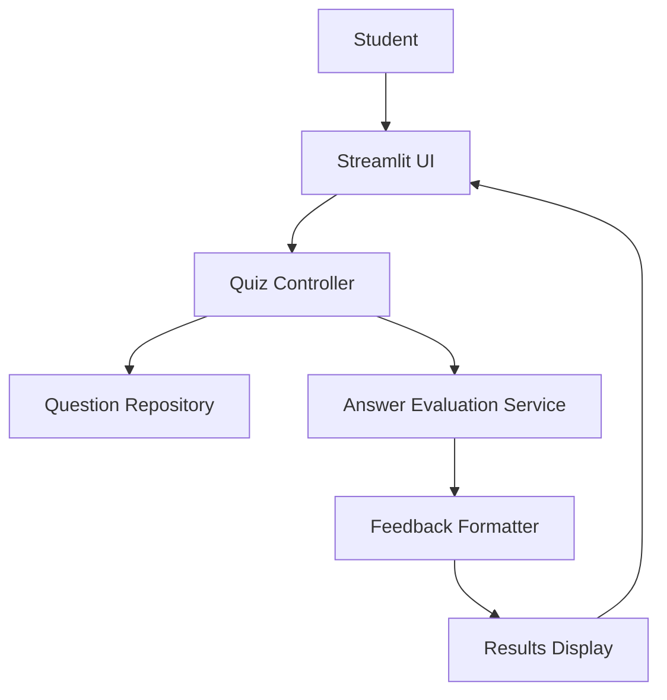
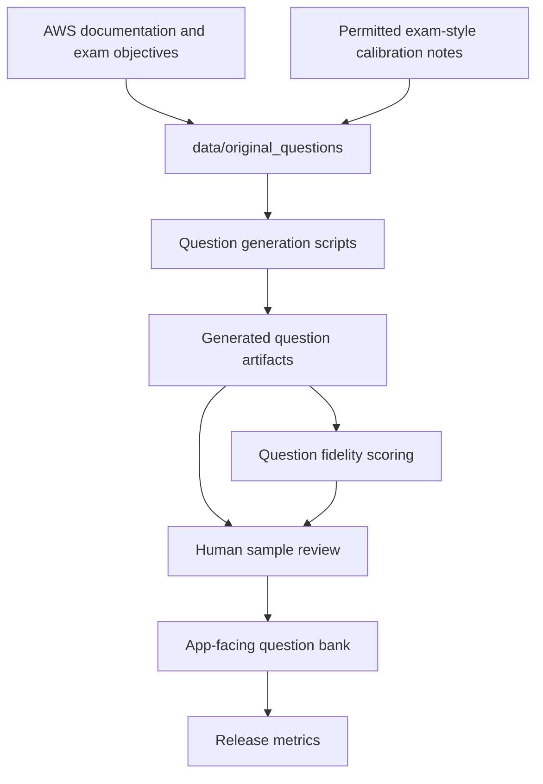

# AWS Certification Coach Architecture

## System Overview

AWS Certification Coach is a Streamlit study application backed by local question artifacts, answer evaluation modules, feedback formatting, and release-quality checks.

The runtime app should stay focused on the learner study loop. Question generation, source calibration, model training, release metrics, and human review happen offline before artifacts are shipped into the app.

## Core Boundaries

### Runtime Study Flow

The runtime flow is responsible for:

- Loading reviewed app-facing questions from local JSON artifacts.
- Filtering questions by certification, domain, difficulty, and eventually `question_type`.
- Presenting one question at a time.
- Accepting learner answers.
- Evaluating learner answers with the configured answer evaluator.
- Returning learner-facing feedback using the shared A/B/C/D/F grade language from `docs/ANSWER_RUBRIC.md`.
- Tracking in-session progress and recent results.

Runtime learner-answer grading is separate from generated-question review. A learner answer receives an A/B/C/D/F grade; a generated question receives question-fidelity scores and accept/revise/reject review decisions before release.

### Question Repository

The question repository stores reviewed certification practice content. JSON remains a suitable storage format while the app is read-heavy and single-user.

App-facing question artifacts should move toward the shared question contract described in `docs/QUESTION_EXPANSION_FEATURE.md`:

- `question_type`
- `certification`
- `exam_code`
- `domain`
- `task_statement`
- `difficulty`
- `question`
- `reference_answer`
- `required_concepts`
- `bonus_concepts`
- `common_misconceptions`
- `acceptable_answers`
- `must_not_claim`
- `source_examples`
- `question_fidelity`
- `exam_calibration`

Multiple-choice provenance should preserve options, correct option IDs, distractor rationales, and distractor classifications. Multi-select source questions should preserve the original selection instruction, such as `Choose TWO`, while still supporting a learner-facing freeform prompt.

Repository responsibilities:

- Load question files.
- Validate required fields.
- Filter by certification, domain, difficulty, and question type.
- Support randomized quiz order.
- Preserve source provenance for post-answer review and release audit.
- Keep storage swappable for a database later if multi-user persistence becomes necessary.

### Quiz Controller

The quiz controller owns session behavior:

- Select the next question.
- Track completed question IDs.
- Track answer history and grades.
- Avoid repeating questions during a session.
- Maintain current filters and quiz mode.

Future advanced-feedback work can add adaptive difficulty, weak-area targeting, timed exam simulation, and persisted learner profiles.

### Answer Evaluation Service

The answer evaluation service evaluates learner answers only. It should not perform generated-question fidelity scoring.

Responsibilities:

- Load evaluator configuration.
- Use the configured local or external answer evaluator through a narrow interface.
- Apply the shared answer rubric from `docs/ANSWER_RUBRIC.md`.
- Return structured evidence such as covered concepts, missing concepts, misconceptions, and improvement suggestions.
- Preserve deterministic behavior where possible so release metrics are reproducible.
- Return controlled errors or fallback feedback when evaluation fails.

The learner-facing grade scale is A/B/C/D/F. Numeric model internals or diagnostic scores may exist for implementation and release analysis, but they should not replace the shared grade language in learner feedback.

### Feedback Formatter

The feedback formatter turns structured evaluation evidence into the final learner display.

Each graded response should include:

- The assigned grade.
- Concepts the learner identified correctly.
- Missing concepts needed for a stronger answer.
- Misconceptions, if any.
- A concise improvement suggestion.
- A reference-quality answer or explanation.

Feedback should explain why plausible but suboptimal answers fall short instead of treating all wrong answers the same way.

## Offline Question Quality Flow

Question expansion and fidelity review happen outside the runtime app.

Generated questions must be self-authored from allowed sources. Do not use exam dumps, copied paid practice-test content, restricted Skill Builder text, or source material whose terms do not allow calibration use.

Question-fidelity review answers different questions than learner-answer grading:

- Is the generated question AWS-valid?
- Is the generated question exam-valid?
- Does it preserve the intended source concept, service boundary, and reasoning pattern?
- Are distractors plausible and classified correctly?
- Is the generated wording self-authored and safe to ship?

See `docs/QUESTION_EXPANSION_FEATURE.md` and `docs/QUESTION_EXPANSION_ARCHITECTURE.md` for the detailed source policy, question types, fidelity fields, and release metrics.

## Data Separation

The project should keep these data categories separate:

- App-facing question artifacts used by the Streamlit app.
- Source and calibration artifacts under `data/original_questions/`.
- Training examples used to tune or evaluate answer grading.
- Final verification data that must not be used for training or threshold tuning.
- Release metrics and generated reports.

Do not commit `data/`, `scripts/data/`, or `metrics/`. Regenerate local artifacts with `./clean.sh` and `./setup.sh` when schema or generated-data behavior changes.

## Release Checks

Before a milestone is considered ready:

- Confirm architecture and rubric docs use the same terminology.
- Confirm learner-answer grading remains separate from question-fidelity scoring.
- Confirm answer-training rows and final verification rows remain separate.
- Run unit tests with `./run_unit_tests.sh`.
- Run the read-only model sanity gate with `./run_model_smoke_tests.sh`.
- Run `./run_model_training_tests.sh` when model behavior or training inputs change; this gate trains temporary held-out models and does not produce a candidate artifact.
- Use `./train_accuracy_model.sh` only when a timestamped candidate model and its diagnostic artifacts are needed.
- Run the explicit deployment suite with `DOCKER_IMAGE=<candidate> ./run_deployment_tests.sh` before deploying an image.
- Run release metrics and update `RELEASE_NOTES.md`.
- Confirm generated data and metrics artifacts are not staged.

Release gates and metric names should live in release tooling and release notes. Roadmap milestones may have target versions, but architecture should describe durable boundaries rather than fixed release sequencing.
