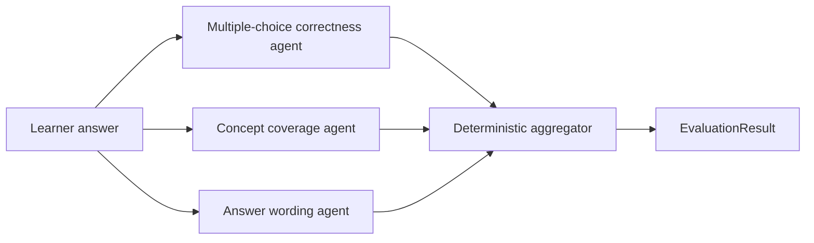

# AWS Certification Coach V1 Design

## V1 Feature Set

V1 should prove the core study loop without reintroducing RAG or account management.

Minimum features:

- Load certification questions from local JSON files.
- Filter questions by certification, domain, and difficulty.
- Start a single-user study session.
- Present one free-response question at a time.
- Accept a learner answer.
- Build a consistent evaluation prompt.
- Evaluate the answer through a narrow evaluator interface.
- Parse model feedback into score, missing concepts, improvements, coaching feedback, and a detailed correct answer.
- Track completed questions and score history for the current session.
- Display feedback and move to the next question.

## V1.2 Three-Agent Grading Design

The detailed scoring policy lives in `GRADING_RUBRIC.md`. Runtime evaluation is split into three independent grading agents so multiple-choice correctness is not mixed with heuristic judgments:

1. `MultipleChoiceCorrectnessAgent` scores canonical-answer selection and distractor rejection from 0 to 100. It receives the original multiple-choice provenance when available and falls back to the reviewed reference answer.
2. `ConceptCoverageAgent` scores required AWS concept coverage from 0 to 100. It reports covered and missing concepts without deciding whether a multiple-choice option was selected.
3. `AnswerWordingAgent` scores clarity, specificity, and readability from 0 to 100. It does not reward verbosity or rescore technical correctness.

The existing `EvaluationService` coordinates provider execution and response parsing. Local providers invoke the three agents directly, while model providers return the three structured judgments. A deterministic `EvaluationAggregator` applies weights of 70% correctness, 20% concept coverage, and 10% wording, then returns the existing `EvaluationResult` contract used by the quiz and UI.

The full-credit invariant takes precedence over the weighted calculation: an understandable answer that identifies every canonical answer, asserts no distractor, and covers every required concept receives 100%. No agent or provider may define fixed maximum scores, letter-grade ceilings, or special-case score caps. Clamping malformed output to the valid 0-100 range remains response validation rather than grading policy.

Initial implementation keeps the existing evaluator-provider boundary for compatibility. The local trained provider supplies evidence used by the three agents, while the OpenAI provider receives a prompt with three explicitly separated judgments. This allows the orchestration and rubric to remain stable as individual agent implementations improve.

## V1.2.1 Model Testing Update (In Progress)

Model evaluation should be separated from unit tests. 
Currently, our unit tests, functional tests, and model evaluation metrics all live in the same test suite. 
We need to split those up into three separate test suites. 

### True Unit Tests
The unit test suite should only cover simple assertions like the conversion of numerical grades into letter grades. 

Run this suite with `./run_tests.sh` or `.venv/bin/python test_suites.py unit`.

### Model Evaluation
The model evaluation itself needs to live in a separate test suite and should be split into two parts.
The first part will contain test cases evaluating how closely the model adheres to the grading rubric. 

The model-evaluation suite contains rubric adherence against curated answers and held-out regression performance. It is not collected by pytest. Run it with `.venv/bin/python test_suites.py model`.

### Release Metrics
This should be a package of python packages which evaluate the question answer distribution of training data.
There is already an existing file called generate_release_metrics.sh that implements the first iteration of this, but it depends on the unit test run.

Release metrics run independently with `./generate_metrics.sh` or `.venv/bin/python test_suites.py release`. Generated JSON, Markdown, and SVG artifacts are written under `release/metrics/`.

####  Complexity Metrics and Code Coverage

As part of the release metrics, we should generate code complexity and code coverage metrics. 
Detailed release notes should be a md file that lives in its own folder called release. 

The existing RELEASE_NOTES.md file should contain only high-level summaries. 

### Grading Flow



### Agent Contracts

- Each agent returns a score from 0 to 100 plus dimension-specific evidence.
- Correctness reports covered canonical options and selected distractors.
- Concept coverage reports covered and missing key concepts.
- Wording reports clarity issues.
- Each agent chooses a qualitative rubric band before assigning its independent numeric score. Agent scores must not be tuned to produce a desired combined grade.
- The aggregator owns weighting, full-credit resolution, learner feedback assembly, and output validation.
- Learner feedback shows every agent's rubric band, raw score, weight, weighted contribution, and explanation before the final score.
- Agent internals and confidence values are never shown to learners.
## Proposed File Structure

```text
AWS-Certification-Coach/
  config/
  data/
    questions/
    training/
    verification/
  scripts/
  src/
    aws_certification_coach/
      evaluation/
      llm/
      observability/
      questions/
      quiz/
      transforms/
      training/
```

## Core Classes

### Domain

- `Question`: immutable certification practice question loaded from JSON.
- `QuestionFilter`: optional certification, domain, and difficulty filters.
- `AnsweredQuestion`: a completed question plus learner answer and evaluation.
- `EvaluationResult`: structured evaluator output with score, missing concepts, improvements, feedback, and a detailed answer.
- `MultipleChoiceQuestion`: original exam-style source question preserved for provenance and post-answer review.
- `MultipleChoiceOption`: answer choice attached to an original multiple-choice question.

### Questions

- `JsonQuestionRepository`: loads and validates JSON question files.
  - `all() -> list[Question]`
  - `filter_questions(filters: QuestionFilter) -> list[Question]`
  - `available_certifications() -> list[str]`
  - `available_domains() -> list[str]`
  - `available_difficulties() -> list[str]`

### Quiz

- `QuizSession`: owns a single learner's in-memory session.
  - `current_question() -> Question | None`
  - `record_answer(question, user_answer, evaluation)`
  - `advance()`
  - `is_complete`
  - `score_history`
  - Randomizes question order when a session starts or resets.

### Evaluation

- `EvaluationPromptBuilder`: builds the provider prompt.
- `EvaluationResponseParser`: parses provider JSON into `EvaluationResult`.
- `EvaluatorProvider`: protocol for model providers.
- `EvaluationService`: coordinates prompt building, provider execution, and parsing.
- `HeuristicEvaluatorProvider`: local fallback provider for development and smoke tests.
- `build_evaluation_service`: creates the configured evaluator service.

### LLM

- `OpenAIEvaluatorProvider`: adapter from the OpenAI Responses API to `EvaluatorProvider`.

### Configuration

- `EvaluatorConfig`: selected provider plus model-specific settings.
- `OpenAIModelConfig`: OpenAI model name and hyperparameters.
- `load_evaluator_config`: reads `config/evaluator_default.json` and environment overrides.

### Observability

- `log_timing`: prints consistent timing records for startup and evaluation latency.

### Transformation

- `TransformationPromptBuilder`: asks a stronger model to convert MCQ items into freeform recall prompts.
- `MultipleChoiceToFreeformTransformer`: applies the transformation to one or many source records.
- `OpenAITransformationProvider`: high-quality transformation provider for offline content generation.
- `HeuristicTransformationProvider`: local deterministic transformer for tests and smoke checks.

### Training

- `AnswerClassificationExample`: labeled learner answer for one question.
- `AnswerRegressionExample`: continuous partial-credit learner answer for one question.
- `AnswerFeatureExtractor`: extracts answer/reference/provenance features.
- `ReinforcementAnswerClassifier`: trains a binary answer classifier with reward-based policy updates.
- `AnswerClassificationModel`: persisted classifier weights and threshold.
- `PartialCreditRegressor`: trains continuous partial-credit scoring by minimizing mean squared error.
- `AnswerRegressionModel`: persisted partial-credit regression weights.
- `scripts/train_answer_classifier.py`: trains the classifier and fails if accuracy is below the required gate or suspiciously perfect.
- `scripts/train_answer_regressor_model.py`: trains the partial-credit regressor and reports MSE/MAE.

## Initial Implementation Notes

- The repository starts with `data/questions/sample_questions.json`, an app-facing question bank generated independently from training labels.
- Combined training and holdout artifacts store the freeform question, original multiple-choice source data, binary answer examples, wrong answers, and partial-credit examples in the same JSON row.
- `scripts/transform_questions.py` converts source MCQ JSON into transformed freeform JSON.
- `scripts/generate_sample_training_artifacts.py` creates the self-authored 100-question training set, 100-question generated verification split, binary answer examples, wrong answers, and partial-credit examples used by the training gates.
- `scripts/generate_app_question_artifacts.py` refreshes the app sample file from app-facing source specs with AWS documentation URLs and no training-only answer labels.
- `scripts/select_sample_questions.py` can still project app-facing rows from a combined artifact for debugging, but it should not be the default app-data generation path.
- The final verification set lives at `data/verification/questions_with_answers_holdout.json` and must not be used by training scripts.
- `scripts/train_answer_regressor_model.py` must stay below the configured held-out MSE gate before its artifact is used by the app.
- V1 defaults to the trained partial-credit regressor in `models/answer_regressor_model.json`; its prediction supplies the application score and the 70-point threshold supplies pass/fail behavior.
- The default real evaluator model is `gpt-5.4-mini`, selected as a quality/cost/latency balance for structured answer evaluation. Offline transformation and training-data generation can use the larger `gpt-5.5` configuration when quality matters more than cost.
- Evaluator provider, model name, and hyperparameters live in `config/evaluator_default.json` and can be overridden with environment variables.
- Set `AWS_COACH_EVALUATOR_PROVIDER=openai` and `OPENAI_API_KEY` to use the OpenAI evaluator provider instead of the trained classifier.
- The Streamlit entry point should remain thin and call package classes instead of embedding workflow logic directly in the UI.

## Acceptance Criteria

- Running the app shows at least one sample AWS question.
- Filters update the available question set.
- Submitting an answer produces a valid `EvaluationResult`.
- The session records completed questions and score history.
- The package modules compile with `python3 -m py_compile`.
