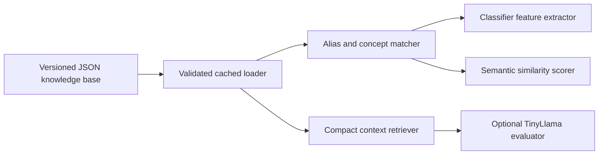

# Knowledge Base Implementation Design

## Purpose

Move reusable AWS terminology and concept relationships out of model code and artifacts into a small, versioned knowledge base. The knowledge base must support deterministic answer scoring and provide compact context to very small language models such as TinyLlama without adding a database, embedding model, or network dependency.

This change also retires the unused answer regressor. Human ratings remain curated semantic-evaluation evidence; they do not become general AWS knowledge.

## Next Iteration Goal

The next design target is a two-document contract that both question generation and answer heuristics can consume without mixing AWS knowledge with generation mechanics:

- `knowledge_base.json`: canonical AWS services, features, concepts, aliases, source URLs, and reusable answer-rubric defaults.
- `question_template.json`: reusable question shapes, prompt wording patterns, distractor recipes, selection rules, and mappings that turn knowledge entries into generated question rows.

The knowledge base should become the canonical source for:

- normalized AWS service and feature identities;
- source documentation URLs;
- reusable concept definitions;
- generated-question rubric fields: `key_concepts`, `common_misconceptions`, `acceptable_answers`, and `must_not_claim`;
- normalized metadata attached to generated multiple-choice answer options.

The question-template document should become the canonical source for:

- prompt variants and scenario wording;
- answer-option ordering and selection instructions;
- distractor generation patterns;
- question-type defaults, such as `service_selection`, `scenario_multiple_choice`, or artifact review;
- rules for composing knowledge-base concepts into app-facing question schema fields.

## Current State

The answer evaluation path currently mixes three different concerns:

- The retired answer-regressor artifact stored trained weights and exact question-and-answer calibration scores.
- `semantic_similarity.py` owns syntax aliases, generic tokens, service-family tokens, and one service alias table as Python constants.
- `structured_answer_training_data.json` contains question-specific key concepts, required concepts, accepted answers, misconceptions, and partial-credit labels.

The production path now uses deterministic semantic scoring with the knowledge base and curated feedback. The former serialized regressor and its generated train/validation/test splits are no longer part of the architecture.

The structured training artifact currently contains 9 questions and 27 distinct `key_concepts`. Those concepts are useful seeds for reusable domain knowledge, but the ratings, accepted answers, misconceptions, question wording, and reference answers must not be copied into the knowledge base.

## Design Decisions

### Separate Knowledge From Templates And Rubrics

The canonical knowledge source is:

`config/knowledge_base/knowledge_base.json`

The canonical question-template source is:

`config/question_templates/question_template.json`

The canonical answer-rubric source is:

`config/answer_rubric/answer_rubric.json`

JSON is preferred over prose-only Markdown because the existing classifier can load it deterministically and a lightweight language-model adapter can render only the relevant entries. Descriptions remain natural language so the file is also understandable in review.

The knowledge document has three top-level content sections:

1. `syntax_aliases`
2. `services`
3. `concepts`

It also carries a `schema_version` and a short `description`. The source file is a committed configuration, not generated training data, a model artifact, or a metrics artifact.

The knowledge document has graduated from answer-evaluation support into a shared source for AWS facts. The file remains curated committed configuration under `config/knowledge_base/`, and generators read from it instead of duplicating service names, source URLs, and concepts in script-local constants.

The template document owns how questions are assembled from those facts, including reusable `service_scenarios`. It should not define canonical service names, AWS source URLs, or answer heuristics. If a template needs AWS Lambda, it references `service_id: "lambda"` or a concept ID from the knowledge base.

The answer-rubric document owns reusable learner-answer grading defaults. It should not define canonical AWS services, source URLs, or prompt wording.

### Calibration Labels Are Not Knowledge

Exact answer ratings must not move into the knowledge base. They remain in curated feedback or structured answer sources as evaluation evidence. Runtime scoring may use explicitly configured curated feedback, but there is no serialized answer model or hidden model calibration table.

This boundary prevents learner-answer labels from becoming hidden production rules and keeps the knowledge base reusable across questions and models.

### Deterministic First, Language Model Optional

Knowledge-base loading and matching must not require an LLM. The existing feature extractor and semantic scorer consume structured aliases and concept-to-service relationships directly. TinyLlama, or another small local model, receives a compact rendering of only the entries selected for the current question and learner answer.

No vector database, embeddings, HTTP service, or full-document prompt is required.

## Knowledge Base Contract

The current schema is:

```json
{
  "schema_version": 2,
  "description": "Canonical AWS service, feature, concept, alias, source, and scenario facts shared by question generation and answer heuristics.",
  "syntax_aliases": [
    {
      "alias": "code build",
      "canonical": "codebuild"
    }
  ],
  "services": [
    {
      "id": "codebuild",
      "name": "AWS CodeBuild",
      "tokens": ["codebuild"],
      "aliases": ["code build"],
      "source_url": "https://docs.aws.amazon.com/codebuild/latest/userguide/welcome.html",
      "description": "A managed build service that runs commands defined for a build project."
    }
  ],
  "concepts": [
    {
      "id": "codebuild-buildspec",
      "name": "CodeBuild buildspec",
      "aliases": ["buildspec", "buildspec file"],
      "service_ids": ["codebuild"],
      "description": "A buildspec defines the install, pre-build, build, and post-build commands that CodeBuild runs."
    }
  ]
}
```

## Question Template Scenario Contract

`question_template.json` stores reusable question mechanics and `service_scenarios`:

```json
{
  "service_scenarios": [
    {
      "id": "aws-codebuild",
      "service_id": "codebuild",
      "domain": "Development with AWS Services",
      "certification": "AWS Certified Developer",
      "exam_code": "DVA-C02",
      "difficulty": "Medium",
      "purpose": "define repeatable build commands",
      "key_concepts": ["CodeBuild buildspec", "build phases"],
      "distractors": ["Define the phases in a CodeDeploy AppSpec file."]
    }
  ]
}
```

## Answer Rubric Contract

The current answer-rubric schema stores an extensible rule list. Each rule keeps the existing `answer_rubric_defaults` section shape:

```json
{
  "schema_version": 2,
  "description": "Reusable learner-answer rubric rules and approved feedback messages.",
  "rules": [
    {
      "id": "service_selection_defaults",
      "description": "Default learner-answer rubric composition for service-selection style questions.",
      "question_types": ["service_selection", "scenario_multiple_choice"],
      "answer_rubric_defaults": {
        "common_misconception_pattern": "{distractor} is the best fit for this requirement.",
        "acceptable_answer_sources": ["correct_option", "reference_answer", "service_name"],
        "must_not_claim_pattern": "{distractor} satisfies the scenario better than {service_name}."
      }
    }
  ],
  "feedback_messages": [
    {
      "id": "full_sentence_for_full_credit",
      "message": "Please write full sentence answers for full credit."
    }
  ]
}
```

Schema v2 adds source and rubric fields while preserving deterministic loading:

```json
{
  "schema_version": 2,
  "description": "Compact AWS terminology, source metadata, and reusable rubric knowledge for AWS Certification Coach.",
  "syntax_aliases": [
    {
      "alias": "code build",
      "canonical": "codebuild"
    }
  ],
  "services": [
    {
      "id": "lambda",
      "name": "AWS Lambda",
      "tokens": ["lambda"],
      "aliases": ["aws lambda", "lambda function"],
      "source": {
        "name": "AWS Documentation: AWS Lambda",
        "url": "https://docs.aws.amazon.com/lambda/latest/dg/welcome.html",
        "license_notes": "AWS documentation was used for topic grounding; generated question text is self-authored."
      },
      "description": "A serverless compute service for running event-driven code without managing servers."
    }
  ],
  "concepts": [
    {
      "id": "lambda-event-driven",
      "name": "event-driven Lambda",
      "aliases": ["event-driven code", "lambda event source"],
      "service_ids": ["lambda"],
      "source": {
        "name": "AWS Documentation: AWS Lambda",
        "url": "https://docs.aws.amazon.com/lambda/latest/dg/welcome.html",
        "license_notes": "AWS documentation was used for topic grounding; generated question text is self-authored."
      },
      "description": "Lambda functions can be invoked by events from AWS services or application integrations.",
      "rubric": {
        "key_concepts": ["AWS Lambda", "serverless", "event-driven"],
        "common_misconceptions": ["Amazon EC2 dedicated hosts are required to run event-driven application code."],
        "acceptable_answers": ["Use AWS Lambda.", "AWS Lambda"],
        "must_not_claim": ["AWS Lambda requires managing EC2 servers for each request."]
      }
    }
  ]
}
```

Contract rules:

- IDs and canonical matching tokens are lowercase and stable.
- Display names and descriptions use current AWS terminology.
- Every `service_id` resolves to exactly one service-family entry.
- Aliases express equivalent terminology or accepted spelling variants, not merely related services.
- Descriptions are one or two short sentences and explain the concept-service relationship in natural language.
- Descriptions do not contain scores, grade thresholds, learner-answer examples, question text, or exam claims.
- Concepts may reference multiple services when the relationship is genuinely cross-service.
- Ambiguous terms are not treated as standalone aliases unless surrounding service or concept evidence disambiguates them.
- Duplicate normalized aliases and unresolved references fail validation.
- Every service-family entry has one canonical `source.url`.
- Every concept entry has either its own `source.url` or inherits source metadata from its associated service when the source is unambiguous.
- Concept `rubric` values are reusable defaults. Generated questions may select a subset or add scenario-specific entries but should not invent conflicting meanings for the same concept.
- `acceptable_answers` can include canonical service answers and short approved aliases, but must not include learner-rating examples or benchmark labels.
- `common_misconceptions` and `must_not_claim` describe wrong reasoning patterns, not exact copied answer text from restricted sources.
- Source metadata must point to public AWS documentation, exam guides, permitted official calibration pages, or self-authored source records.

## Shared Generation and Answer-Heuristic Contract

Question generation and answer heuristics should use the same normalized identifiers.

Generation uses the knowledge base to:

- choose canonical services and concepts for a scenario;
- populate `key_concepts` from concept rubric defaults;
- populate `common_misconceptions`, `acceptable_answers`, and `must_not_claim` from selected concepts and scenario-specific distractors;
- attach source metadata to the question and each answer option;
- produce consistent option metadata for services, features, and distractors.

Generation uses question templates to:

- choose a prompt shape for the target question type and certification;
- render scenario wording from a safe self-authored template;
- decide how many answer options to emit and where correct options are placed;
- transform concept rubric defaults into question-local fields;
- add scenario-specific misconceptions, distractors, and constraints without changing canonical AWS facts.

Answer heuristics use the knowledge base to:

- canonicalize service names and aliases;
- match learner answers against `acceptable_answers` and concept aliases;
- detect `common_misconceptions` and `must_not_claim` violations;
- enforce service-boundary checks, such as distinguishing Lambda from EC2, SNS from SQS, or KMS from Secrets Manager;
- render bounded documentation context when feedback needs a source link.

The shared contract prevents the generator from saying one thing and the answer heuristic grading against another. If an AWS concept changes, the canonical update belongs in the knowledge base first. If the way a question is phrased or assembled changes, the update belongs in the question-template document.

## Question Template Contract

`question_template.json` should describe generation behavior without becoming an AWS knowledge store.

```json
{
  "schema_version": 1,
  "description": "Reusable self-authored question templates for AWS Certification Coach generation.",
  "templates": [
    {
      "id": "service-selection-freeform",
      "question_type": "service_selection",
      "certifications": ["Cloud Practitioner", "Solutions Architect Associate", "AWS Certified Developer"],
      "prompt_variants": [
        "Explain which AWS service or feature should be used to {purpose}.",
        "Which AWS capability best meets a requirement to {purpose}? Explain the selection."
      ],
      "reference_answer_pattern": "Use {service_name} to {purpose}.",
      "option_pattern": "Use {service_name}.",
      "required_slots": ["service_id", "purpose", "concept_ids", "distractor_service_ids"],
      "rubric_merge": {
        "key_concepts": "selected_concept_defaults",
        "common_misconceptions": "selected_concept_defaults_plus_distractors",
        "acceptable_answers": "selected_concept_defaults_plus_service_name",
        "must_not_claim": "selected_concept_defaults_plus_distractors"
      }
    }
  ]
}
```

Template contract rules:

- Templates may reference `service_id`, `concept_ids`, and `distractor_service_ids`, but they do not define canonical service names or URLs.
- Templates own wording patterns, slot names, question type, answer-option shape, and rubric merge strategy.
- Templates must use self-authored wording and must not contain copied restricted exam text.
- Templates must not contain learner grades, benchmark ratings, final verification labels, or source-of-truth AWS descriptions.
- A template cannot generate a question until all referenced services and concepts are resolved in the knowledge base.
- Template IDs are stable because generated artifacts and tests can cite them as provenance.

## Generated Question Contract

Generated questions should continue to include question-local fields because the app and evaluator need a self-contained artifact:

```json
{
  "question": "Explain which AWS service or feature should be used to run event-driven code without managing servers.",
  "reference_answer": "Use AWS Lambda to run event-driven code without managing servers.",
  "key_concepts": ["AWS Lambda", "serverless", "event-driven"],
  "common_misconceptions": ["Amazon EC2 dedicated hosts are required to run event-driven application code."],
  "acceptable_answers": ["Use AWS Lambda.", "AWS Lambda"],
  "must_not_claim": ["AWS Lambda requires managing EC2 servers for each request."],
  "source_url": "https://docs.aws.amazon.com/lambda/latest/dg/welcome.html",
  "original_multiple_choice": {
    "options": [
      {
        "option_id": "A",
        "text": "Use AWS Lambda.",
        "source_url": "https://docs.aws.amazon.com/lambda/latest/dg/welcome.html",
        "metadata": {
          "service_id": "lambda",
          "service_name": "AWS Lambda",
          "source_url": "https://docs.aws.amazon.com/lambda/latest/dg/welcome.html",
          "concept_ids": ["lambda-event-driven"]
        }
      }
    ]
  }
}
```

Question-local fields are generated from the knowledge base so the app remains simple at runtime. They should not become a second source of truth. When generated data is refreshed, repeated references to a service must resolve to the same `service_id`, `service_name`, and `source_url`.

The normalized option metadata should be required for every generated option that maps to a known AWS service or feature:

- `service_id`: stable lowercase ID from `services`.
- `service_name`: display name from `services`.
- `source_url`: canonical service or concept documentation URL.
- `concept_ids`: concept IDs represented by the option when known.
- `is_known_service`: optional boolean for distractors that are AWS services but not the correct answer.

Free-text `text` remains learner-facing. Metadata is for deterministic rendering, source documentation, scoring, and tests.

## Source URL Rules

Source URLs should be normalized at the knowledge-base layer.

- A service has exactly one default documentation URL.
- A concept may override the service URL when AWS has a more precise page for that feature, such as SQS visibility timeout or Lambda authorizers.
- Generated question rows should include the best source URL for the correct concept.
- Generated answer options should include the best source URL for the service or concept named by that option.
- Duplicate URLs should be de-duplicated in UI source documentation, but the underlying generated option metadata should still carry the URL.
- Missing URLs for known services or concepts should fail generation validation.

## Initial Content

### Syntax Aliases

Migrate the normalization-only aliases currently defined in `semantic_similarity.py`, including joined AWS product names such as `api gateway` to `apigateway`, `cloud trail` to `cloudtrail`, and `code build` to `codebuild`.

The migration must preserve current matching behavior before adding new aliases. Alias tests should become data-driven against the knowledge document.

### Service Families

Migrate the current service-family tokens into full service entries rather than keeping an unexplained token set. The initial document should cover the existing families (`DynamoDB`, `EC2`, `IAM`, `Kinesis`, `Lambda`, `RDS`, `S3`, and `VPC`) plus every service required by the structured training concepts: AWS Budgets, AWS Config, AWS CloudTrail, AWS CodeBuild, AWS KMS, AWS Secrets Manager, Amazon SQS, and Amazon API Gateway.

Each entry explains what binds its concepts together. A family is used to recognize a service boundary, not to award credit merely because a generic service token appears.

## Structured Training Concept Expansion

After the initial alias and service-family migration is behaviorally equivalent, add one knowledge-base entry for every item in the `key_concepts` lists in `config/data/structured_answer_training_data.json`.

The first expansion contains these 27 concept entries and service associations:

| Concept | Associated service or family | Natural-language focus |
|:--|:--|:--|
| CodeBuild buildspec | AWS CodeBuild | The file that declares commands and phases for a CodeBuild run. |
| build phases | AWS CodeBuild | Ordered install, pre-build, build, and post-build work within a buildspec. |
| test commands | AWS CodeBuild | Test invocations run by the managed build as declared commands. |
| AWS Budgets | AWS Budgets | The budgeting service for cost or usage tracking and notifications. |
| cost thresholds | AWS Budgets | Actual or forecasted budget limits that can trigger notifications. |
| alerts | AWS Budgets | Notifications emitted when configured budget conditions are reached. |
| AWS Config | AWS Config | The service that records supported resource configuration state and evaluates rules. |
| configuration history | AWS Config | A time-ordered record of supported resource configuration changes. |
| compliance rules | AWS Config | Managed or custom rules used to evaluate resource configurations. |
| Secrets Manager | AWS Secrets Manager | The service for storing, retrieving, and rotating secrets. |
| database credentials | AWS Secrets Manager | Database usernames and passwords managed as secrets rather than embedded in code. |
| scheduled rotation | AWS Secrets Manager | Automated secret replacement on a configured schedule. |
| SQS visibility timeout | Amazon SQS | The period in which a received message stays hidden from other consumers. |
| hide message from other consumers | Amazon SQS | The processing isolation supplied by the visibility timeout. |
| processing window | Amazon SQS | The time a consumer has before the message can become visible again. |
| AWS KMS | AWS Key Management Service | The managed service for creating and controlling encryption keys. |
| encryption keys | AWS Key Management Service | Cryptographic keys whose use and access are controlled through KMS. |
| key management | AWS Key Management Service | The lifecycle and access control of encryption keys. |
| AWS CloudTrail | AWS CloudTrail | The service that records AWS account activity and API events. |
| API activity | AWS CloudTrail | Management or data events produced by calls to AWS APIs. |
| auditing | AWS CloudTrail | Reviewing recorded activity to understand actions and actors. |
| S3 Lifecycle | Amazon S3 | Rules that transition or expire objects based on age or other lifecycle criteria. |
| object expiration | Amazon S3 | Automatic removal of objects by an S3 Lifecycle expiration action. |
| API Gateway | Amazon API Gateway | The managed API front door that routes requests to backend integrations. |
| Lambda authorizer | API Gateway and AWS Lambda | Custom authorization logic run for an API Gateway request using Lambda. |
| custom authorization | API Gateway and AWS Lambda | Application-specific request authorization performed before backend invocation. |
| backend integration | API Gateway and AWS Lambda | The configured connection from an API route to its backend, including a Lambda function. |

The implementation should derive and validate the inventory from the structured artifact so later additions to `key_concepts` cannot silently remain undocumented. The knowledge descriptions themselves are curated source content and must not be generated into `data/`.

## Runtime Architecture



Add a small package such as `src/aws_certification_coach/knowledge_base/` with:

- typed immutable records for aliases, services, and concepts;
- a loader that validates schema and referential integrity once;
- normalized lookup indexes built in memory;
- deterministic retrieval by question concepts, service aliases, and learner-answer tokens;
- a compact text renderer for optional model prompts.

The application should load the knowledge base once when constructing an evaluator and inject it into the feature extractor or scorer. Library code must not repeatedly read the file for each answer.

## Low-Overhead Model Access

The context retriever should select knowledge in this order:

1. Exact normalized matches to the question's `required_concepts` and `key_concepts`.
2. Service families referenced by those matched concepts.
3. Alias matches found in the learner answer.

The renderer should emit compact, predictable lines, for example:

```text
CONCEPT: SQS visibility timeout
SERVICES: Amazon SQS
MEANING: The period in which a received message stays hidden from other consumers.
ALIASES: visibility timeout
```

Default limits should be configurable and conservative: at most the question's relevant concepts and their referenced service families, with no unrelated knowledge entries. The retrieval result must be deterministic, stable in order, and independently testable. TinyLlama is an optional consumer of this context, not a required runtime dependency.

The deterministic evaluator uses the same entries as structured signals:

- syntax aliases normalize tokens before feature extraction;
- concept aliases contribute only to the corresponding concept coverage calculation;
- service IDs support service-boundary and incorrect-service checks;
- natural-language descriptions are not converted into opaque learned weights at runtime.

## Regressor Retirement

The answer-regression model, provider, training scripts, generated split data, and model-specific release metrics are removed. Curated answer ratings remain available to report semantic accuracy and diagnose cases the deterministic evaluator misses. If scoring regresses, improve the knowledge-backed rules or curated benchmark rather than restoring a second, unused model path.

## Implementation Phases

### Completed Baseline: Answer-Evaluation Knowledge

- JSON knowledge document, typed loader, schema validation, and unit tests.
- Syntax aliases, service families, and initial structured concepts.
- Deterministic concept selection and compact rendering.
- Semantic matching can consume the knowledge base without a heavyweight runtime dependency.

### Phase 1: Shared Contract Upgrade

- Bump the schema to include service and concept `source` metadata.
- Add concept-level reusable `rubric` defaults for `key_concepts`, `common_misconceptions`, `acceptable_answers`, and `must_not_claim`.
- Add `config/question_templates/question_template.json` for generation patterns, prompt variants, answer-option shapes, and rubric merge rules.
- Add typed domain records for normalized option metadata.
- Preserve backward-compatible loading only long enough for migration tests; generated artifacts should target the new contract.

### Phase 2: Generator Integration

- Replace generator-local service URL maps with knowledge-base lookups.
- Replace generator-local rubric boilerplate with knowledge-base concept rubric defaults plus scenario-specific additions.
- Replace generator-local prompt variants and option wording with question-template lookups.
- Emit question-level `source_url`.
- Emit normalized option metadata for every known AWS service or feature in generated answer choices.
- Add generation validation that fails on missing service metadata, missing URLs, unresolved template slots, or inconsistent repeated service names.

### Phase 3: Answer-Heuristic Integration

- Teach answer heuristics to use knowledge-base `acceptable_answers`, concept aliases, `common_misconceptions`, and `must_not_claim`.
- Keep learner-rating examples and final verification labels out of the knowledge base.
- Verify service-boundary behavior against normalized metadata, not raw answer text.
- Preserve the current A/B/C/D/F learner-answer rubric.

### Phase 4: Release and Review Metrics

- Report knowledge schema version and source coverage counts.
- Report generated-option metadata coverage.
- Report generated-question rubric-field coverage.
- Keep question fidelity and learner-answer grading metrics separate.
- Confirm generated `data/`, generated `metrics/`, and any local original source downloads are not staged.

## Validation and Release Metrics

Required automated checks:

- JSON schema and reference validation.
- Alias normalization parity with the current hard-coded tables.
- Exact coverage of structured-training `key_concepts` after Phase 2.
- No rating, grade, question text, reference answer, or partial-answer fields in the knowledge base.
- Deterministic retrieval returns only relevant concepts in stable order.
- Existing classification and semantic-similarity tests pass with injected knowledge.
- Every service-family entry has source metadata.
- Every concept has source metadata or an unambiguous inherited service source.
- Every concept rubric contains the four generated-question fields.
- Every question template references only known slot names and declares a stable template ID.
- Every generated question has `key_concepts`, `common_misconceptions`, `acceptable_answers`, `must_not_claim`, and `source_url`.
- Every generated answer option that references a known AWS service has normalized metadata with `service_id`, `service_name`, and `source_url`.
- Repeated mentions of the same AWS service across generated questions resolve to the same normalized metadata.

Release reporting should add:

- knowledge schema version;
- knowledge file byte size;
- syntax-alias, service-family, and concept counts;
- loader initialization time and average deterministic lookup time;
- semantic within-one-letter, per-grade, and grade-band metrics;
- curated exact-letter accuracy and mismatch report;
- optional lightweight-model accuracy and latency, reported separately from classifier metrics.

The release gate should compare semantic metrics against the existing baseline. A failure is a reason to improve deterministic scoring or knowledge coverage, not to leak benchmark labels into the knowledge document.

## Acceptance Criteria

- A single committed JSON document is the source of truth for service IDs, service display names, service aliases, concept IDs, concept aliases, source URLs, and reusable rubric defaults.
- A separate committed question-template JSON document is the source of truth for prompt variants, option patterns, question-type defaults, and rubric merge rules.
- Question generators read service URLs and service names from the knowledge base instead of script-local URL maps.
- Question generators read prompt and answer-option patterns from question templates instead of script-local constants.
- Generated questions include `key_concepts`, `common_misconceptions`, `acceptable_answers`, `must_not_claim`, and `source_url` derived from knowledge-base concepts plus scenario-specific additions.
- Generated multiple-choice options include normalized metadata for known AWS services and features.
- Every generated option mentioning AWS Lambda uses the same `service_id`, `service_name`, and `source_url`; the same rule applies to every other known service.
- Answer heuristics use the same knowledge-base aliases, rubric fields, and service boundaries used by generation.
- Human ratings remain in curated training/evaluation sources and do not appear in the knowledge base.
- Runtime operation remains local, offline, and free of new heavyweight dependencies.
- Generated `data/` and `metrics/` artifacts are not committed.

## Risks and Mitigations

- **Accuracy falls when exact overrides are removed.** Preserve the old metrics as a baseline, add no-override evaluation, and improve generalizable features rather than restoring memorized scores.
- **Aliases create false positives.** Keep ambiguous tokens scoped to a service or concept and test negative examples.
- **Knowledge content drifts from training concepts.** Enforce bidirectional concept coverage in tests.
- **Tiny-model prompts become too large.** Retrieve by required concept first and enforce small entry and character limits.
- **The knowledge base becomes another model artifact.** Keep it human-reviewed, versioned configuration with no learned weights or answer labels.
- **AWS terminology changes.** Treat content updates as reviewed configuration changes with schema validation and targeted scoring tests.

## Out of Scope

- Replacing the current classifier with TinyLlama.
- Adding embeddings, a vector database, or a hosted retrieval service.
- Automatically generating production knowledge descriptions from training data.
- Moving final verification labels into training or knowledge artifacts.
- Changing the learner-facing A/B/C/D/F rubric.
