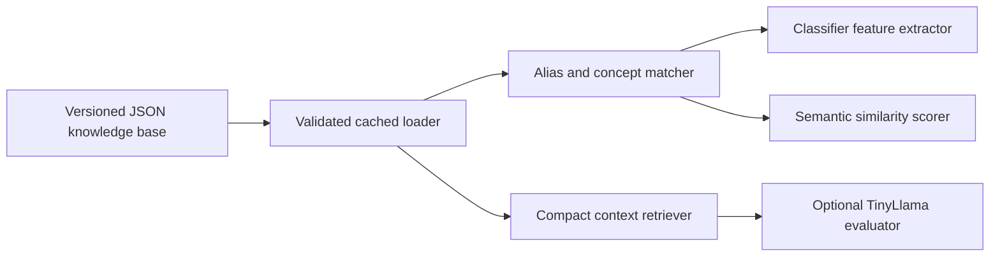

# Knowledge Base Implementation Design

## Purpose

Move reusable AWS terminology and concept relationships out of model code and artifacts into a small, versioned knowledge base. The knowledge base must support deterministic answer scoring and provide compact context to very small language models such as TinyLlama without adding a database, embedding model, or network dependency.

This change also retires the unused answer regressor. Human ratings remain curated semantic-evaluation evidence; they do not become general AWS knowledge.

## Current State

The answer evaluation path currently mixes three different concerns:

- The retired answer-regressor artifact stored trained weights and exact question-and-answer calibration scores.
- `semantic_similarity.py` owns syntax aliases, generic tokens, service-family tokens, and one service alias table as Python constants.
- `structured_answer_training_data.json` contains question-specific key concepts, required concepts, accepted answers, misconceptions, and partial-credit labels.

The production path now uses deterministic semantic scoring with the knowledge base and curated feedback. The former serialized regressor and its generated train/validation/test splits are no longer part of the architecture.

The structured training artifact currently contains 9 questions and 27 distinct `key_concepts`. Those concepts are useful seeds for reusable domain knowledge, but the ratings, accepted answers, misconceptions, question wording, and reference answers must not be copied into the knowledge base.

## Design Decisions

### One Structured Knowledge Document

The canonical source will be:

`config/knowledge_base/aws_answer_knowledge_base.json`

JSON is preferred over prose-only Markdown because the existing classifier can load it deterministically and a lightweight language-model adapter can render only the relevant entries. Descriptions remain natural language so the file is also understandable in review.

The document has three top-level content sections:

1. `syntax_aliases`
2. `service_families`
3. `concepts`

It also carries a `schema_version` and a short `description`. The source file is committed configuration, not generated training data, a model artifact, or a metrics artifact.

### Calibration Labels Are Not Knowledge

Exact answer ratings must not move into the knowledge base. They remain in curated feedback or structured answer sources as evaluation evidence. Runtime scoring may use explicitly configured curated feedback, but there is no serialized answer model or hidden model calibration table.

This boundary prevents learner-answer labels from becoming hidden production rules and keeps the knowledge base reusable across questions and models.

### Deterministic First, Language Model Optional

Knowledge-base loading and matching must not require an LLM. The existing feature extractor and semantic scorer consume structured aliases and concept-to-service relationships directly. TinyLlama, or another small local model, receives a compact rendering of only the entries selected for the current question and learner answer.

No vector database, embeddings, HTTP service, or full-document prompt is required.

## Knowledge Base Contract

The initial schema is:

```json
{
  "schema_version": 1,
  "description": "Compact AWS terminology and concept knowledge for answer evaluation.",
  "syntax_aliases": [
    {
      "alias": "code build",
      "canonical": "codebuild"
    }
  ],
  "service_families": [
    {
      "id": "codebuild",
      "name": "AWS CodeBuild",
      "tokens": ["codebuild"],
      "aliases": ["code build"],
      "description": "A managed build service that runs commands defined for a build project."
    }
  ],
  "concepts": [
    {
      "id": "codebuild-buildspec",
      "name": "CodeBuild buildspec",
      "aliases": ["buildspec", "buildspec file"],
      "service_ids": ["codebuild"],
      "description": "A buildspec defines the install, pre-build, build, and post-build commands that CodeBuild runs."
    }
  ]
}
```

Contract rules:

- IDs and canonical matching tokens are lowercase and stable.
- Display names and descriptions use current AWS terminology.
- Every `service_id` resolves to exactly one service-family entry.
- Aliases express equivalent terminology or accepted spelling variants, not merely related services.
- Descriptions are one or two short sentences and explain the concept-service relationship in natural language.
- Descriptions do not contain scores, grade thresholds, learner-answer examples, question text, or exam claims.
- Concepts may reference multiple services when the relationship is genuinely cross-service.
- Ambiguous terms are not treated as standalone aliases unless surrounding service or concept evidence disambiguates them.
- Duplicate normalized aliases and unresolved references fail validation.

## Initial Content

### Syntax Aliases

Migrate the normalization-only aliases currently defined in `semantic_similarity.py`, including joined AWS product names such as `api gateway` to `apigateway`, `cloud trail` to `cloudtrail`, and `code build` to `codebuild`.

The migration must preserve current matching behavior before adding new aliases. Alias tests should become data-driven against the knowledge document.

### Service Families

Migrate the current service-family tokens into full service entries rather than keeping an unexplained token set. The initial document should cover the existing families (`DynamoDB`, `EC2`, `IAM`, `Kinesis`, `Lambda`, `RDS`, `S3`, and `VPC`) plus every service required by the structured training concepts: AWS Budgets, AWS Config, AWS CloudTrail, AWS CodeBuild, AWS KMS, AWS Secrets Manager, Amazon SQS, and Amazon API Gateway.

Each entry explains what binds its concepts together. A family is used to recognize a service boundary, not to award credit merely because a generic service token appears.

## Structured Training Concept Expansion

After the initial alias and service-family migration is behaviorally equivalent, add one knowledge-base entry for every item in the `key_concepts` lists in `config/data/structured_answer_training_data.json`.

The first expansion contains these 27 concept entries and service associations:

| Concept | Associated service or family | Natural-language focus |
|:--|:--|:--|
| CodeBuild buildspec | AWS CodeBuild | The file that declares commands and phases for a CodeBuild run. |
| build phases | AWS CodeBuild | Ordered install, pre-build, build, and post-build work within a buildspec. |
| test commands | AWS CodeBuild | Test invocations run by the managed build as declared commands. |
| AWS Budgets | AWS Budgets | The budgeting service for cost or usage tracking and notifications. |
| cost thresholds | AWS Budgets | Actual or forecasted budget limits that can trigger notifications. |
| alerts | AWS Budgets | Notifications emitted when configured budget conditions are reached. |
| AWS Config | AWS Config | The service that records supported resource configuration state and evaluates rules. |
| configuration history | AWS Config | A time-ordered record of supported resource configuration changes. |
| compliance rules | AWS Config | Managed or custom rules used to evaluate resource configurations. |
| Secrets Manager | AWS Secrets Manager | The service for storing, retrieving, and rotating secrets. |
| database credentials | AWS Secrets Manager | Database usernames and passwords managed as secrets rather than embedded in code. |
| scheduled rotation | AWS Secrets Manager | Automated secret replacement on a configured schedule. |
| SQS visibility timeout | Amazon SQS | The period in which a received message stays hidden from other consumers. |
| hide message from other consumers | Amazon SQS | The processing isolation supplied by the visibility timeout. |
| processing window | Amazon SQS | The time a consumer has before the message can become visible again. |
| AWS KMS | AWS Key Management Service | The managed service for creating and controlling encryption keys. |
| encryption keys | AWS Key Management Service | Cryptographic keys whose use and access are controlled through KMS. |
| key management | AWS Key Management Service | The lifecycle and access control of encryption keys. |
| AWS CloudTrail | AWS CloudTrail | The service that records AWS account activity and API events. |
| API activity | AWS CloudTrail | Management or data events produced by calls to AWS APIs. |
| auditing | AWS CloudTrail | Reviewing recorded activity to understand actions and actors. |
| S3 Lifecycle | Amazon S3 | Rules that transition or expire objects based on age or other lifecycle criteria. |
| object expiration | Amazon S3 | Automatic removal of objects by an S3 Lifecycle expiration action. |
| API Gateway | Amazon API Gateway | The managed API front door that routes requests to backend integrations. |
| Lambda authorizer | API Gateway and AWS Lambda | Custom authorization logic run for an API Gateway request using Lambda. |
| custom authorization | API Gateway and AWS Lambda | Application-specific request authorization performed before backend invocation. |
| backend integration | API Gateway and AWS Lambda | The configured connection from an API route to its backend, including a Lambda function. |

The implementation should derive and validate the inventory from the structured artifact so later additions to `key_concepts` cannot silently remain undocumented. The knowledge descriptions themselves are curated source content and must not be generated into `data/`.

## Runtime Architecture



Add a small package such as `src/aws_certification_coach/knowledge_base/` with:

- typed immutable records for aliases, services, and concepts;
- a loader that validates schema and referential integrity once;
- normalized lookup indexes built in memory;
- deterministic retrieval by question concepts, service aliases, and learner-answer tokens;
- a compact text renderer for optional model prompts.

The application should load the knowledge base once when constructing an evaluator and inject it into the feature extractor or scorer. Library code must not repeatedly read the file for each answer.

## Low-Overhead Model Access

The context retriever should select knowledge in this order:

1. Exact normalized matches to the question's `required_concepts` and `key_concepts`.
2. Service families referenced by those matched concepts.
3. Alias matches found in the learner answer.

The renderer should emit compact, predictable lines, for example:

```text
CONCEPT: SQS visibility timeout
SERVICES: Amazon SQS
MEANING: The period in which a received message stays hidden from other consumers.
ALIASES: visibility timeout
```

Default limits should be configurable and conservative: at most the question's relevant concepts and their referenced service families, with no unrelated knowledge entries. The retrieval result must be deterministic, stable in order, and independently testable. TinyLlama is an optional consumer of this context, not a required runtime dependency.

The deterministic evaluator uses the same entries as structured signals:

- syntax aliases normalize tokens before feature extraction;
- concept aliases contribute only to the corresponding concept coverage calculation;
- service IDs support service-boundary and incorrect-service checks;
- natural-language descriptions are not converted into opaque learned weights at runtime.

## Regressor Retirement

The answer-regression model, provider, training scripts, generated split data, and model-specific release metrics are removed. Curated answer ratings remain available to report semantic accuracy and diagnose cases the deterministic evaluator misses. If scoring regresses, improve the knowledge-backed rules or curated benchmark rather than restoring a second, unused model path.

## Implementation Phases

### Phase 1: Contract and Initial Knowledge

- Add the JSON knowledge document, typed loader, schema validation, and unit tests.
- Populate Syntax Aliases and Service Families.
- Inject the loader into semantic matching without changing expected alias behavior.
- Measure load time, file size, and per-answer lookup overhead.

### Phase 2: Concept Expansion

- Add all 27 current structured-training concepts with natural-language descriptions and service references.
- Add a coverage test comparing knowledge concept names with the union of structured `key_concepts`.
- Extend deterministic concept and service matching to use the knowledge indexes.

### Phase 3: Regressor Retirement

- Remove the unused regressor runtime and training workflow.
- Remove generated training, validation, and test splits used only by that workflow.
- Calculate exact-letter, within-one-letter, per-grade, and grade-band metrics directly from semantic evaluation.
- Keep knowledge-base and question-quality reporting as independent release metrics.

### Phase 4: Lightweight Context Adapter

- Add deterministic retrieval and compact rendering.
- Integrate it only with evaluators that explicitly support local language-model context.
- Keep classifier-only operation as the default low-overhead path.

## Validation and Release Metrics

Required automated checks:

- JSON schema and reference validation.
- Alias normalization parity with the current hard-coded tables.
- Exact coverage of structured-training `key_concepts` after Phase 2.
- No rating, grade, question text, reference answer, or partial-answer fields in the knowledge base.
- Deterministic retrieval returns only relevant concepts in stable order.
- Existing classification and semantic-similarity tests pass with injected knowledge.

Release reporting should add:

- knowledge schema version;
- knowledge file byte size;
- syntax-alias, service-family, and concept counts;
- loader initialization time and average deterministic lookup time;
- semantic within-one-letter, per-grade, and grade-band metrics;
- curated exact-letter accuracy and mismatch report;
- optional lightweight-model accuracy and latency, reported separately from classifier metrics.

The release gate should compare semantic metrics against the existing baseline. A failure is a reason to improve deterministic scoring or knowledge coverage, not to leak benchmark labels into the knowledge document.

## Acceptance Criteria

- A single committed JSON document contains Syntax Aliases, Service Families, and natural-language concept entries.
- Every current structured training `key_concepts` item has an explicit service association and description.
- Alias and service-family constants are no longer duplicated in scoring code.
- No answer-regressor artifact or generated split workflow remains.
- Human ratings remain in curated training/evaluation sources and do not appear in the knowledge base.
- The existing evaluator can use the knowledge base with deterministic, in-process lookups.
- TinyLlama can receive a bounded relevant excerpt without loading the entire knowledge base into its prompt.
- Runtime operation remains local, offline, and free of new heavyweight dependencies.
- Generated `data/` and `metrics/` artifacts are not committed.

## Risks and Mitigations

- **Accuracy falls when exact overrides are removed.** Preserve the old metrics as a baseline, add no-override evaluation, and improve generalizable features rather than restoring memorized scores.
- **Aliases create false positives.** Keep ambiguous tokens scoped to a service or concept and test negative examples.
- **Knowledge content drifts from training concepts.** Enforce bidirectional concept coverage in tests.
- **Tiny-model prompts become too large.** Retrieve by required concept first and enforce small entry and character limits.
- **The knowledge base becomes another model artifact.** Keep it human-reviewed, versioned configuration with no learned weights or answer labels.
- **AWS terminology changes.** Treat content updates as reviewed configuration changes with schema validation and targeted scoring tests.

## Out of Scope

- Replacing the current classifier with TinyLlama.
- Adding embeddings, a vector database, or a hosted retrieval service.
- Automatically generating production knowledge descriptions from training data.
- Moving final verification labels into training or knowledge artifacts.
- Changing the learner-facing A/B/C/D/F rubric.
