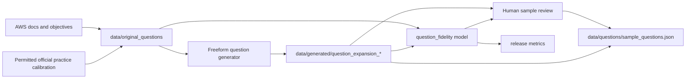

# Question Quality Expansion Feature Design

## Purpose

Phase 1 expands the local question bank so AWS Certification Coach better reflects the AWS Certified Developer Associate exam while preserving the project rule that app-facing questions, model-training labels, and final verification data stay separate.

This design supports the roadmap in `docs/QUESTION_IMPROVEMENT_ROADMAP.md` and the rubric-stabilization work in `docs/TODO.md`. The current pass is code-free: standardize the question-quality, question-fidelity, and learner-answer language before changing implementation behavior.

## Goals

- Add AWS Developer Associate coverage to the app-facing question bank.
- Increase question diversity, improve distractors, add distractor classifications, and improve exam realism.
- Use permitted AWS exam-style calibration material to validate that generated questions resemble the AWS Certified Developer Associate exam, not just general AWS documentation.
- Store downloaded or collected source metadata and calibration notes under `data/original_questions/`.
- Generate self-authored freeform questions from source concepts without copying restricted exam text.
- Train a separate local semantic model for question fidelity scoring.
- Report a `question fidelity` metric as a percentage in release notes.
- Keep question-fidelity scoring independent from answer semantic evaluation.
- Maintain train, validation, and test separation for all model work.

## Standard Language

Use these terms consistently across the question-expansion architecture, answer rubric, and implementation notes:

- `question quality`: the overall app-facing quality of a question batch, including diversity, distractor quality, domain coverage, exam realism, and source safety.
- `question fidelity`: release-facing score for generated question quality. It may combine `concept fidelity`, `exam-style fidelity`, distractor quality, technical correctness, and source safety.
- `concept fidelity`: whether the generated question preserves the intended AWS concept, service boundary, decision point, and reasoning pattern.
- `exam-style fidelity`: whether the generated question resembles permitted Developer Associate calibration patterns and requires applied exam reasoning.
- `learner-answer grading`: A/B/C/D/F grading of a learner response. This is separate from question fidelity.
- `AWS-valid`: the question and reference answer are technically accurate according to AWS documentation.
- `exam-valid`: the question resembles a permitted Developer Associate exam-style calibration pattern and tests the expected domain reasoning.

Use A/B/C/D/F only for learner-answer grades. Use 0-100 percentages or accept/revise/reject decisions for generated-question review.

## Non-Goals

- Do not ingest real exam dumps, paid practice-test content, or restricted AWS Skill Builder material.
- Do not replace the existing `semantic_similarity` answer evaluator.
- Do not link question-fidelity model weights to answer-grading model weights.
- Do not push Docker images or create GitHub tags before human review.

## Data Flow

## Source Question Policy

Source examples should be limited to material that can be legally used for topic, style, and scope grounding:

- AWS documentation pages.
- AWS public exam guides and official objective descriptions.
- AWS official sample questions and official practice-question previews when their terms allow local review for calibration.
- Self-authored scenarios based on public AWS service behavior.

Do not use real exam dumps, copied paid practice banks, restricted Skill Builder question text, or any source whose terms do not allow this use. Official practice material should be used to extract calibration metadata such as domain, concept, difficulty, distractor style, scenario shape, and wording pattern. Generated app questions must not copy official question text.

Every source row should include:

- `source_name`
- `source_url`
- `source_license_notes`
- `certification`
- `domain`
- `task_statement`
- `services`
- `concepts`
- `difficulty`
- `source_type`: `documentation`, `exam_guide`, `official_sample`, `official_practice_preview`, or `self_authored`
- `allowed_use`: short note explaining why the source can be used for calibration
- `exam_style_notes`: concise notes on scenario length, decision point, distractor pattern, and expected reasoning

For official sample or official practice calibration rows, store summarized metadata and notes rather than copied question text unless the source license explicitly allows local storage of the text.

Raw source artifacts should live under `data/original_questions/`, which is ignored by source control through `/data/`.

## Exam Calibration Requirements

Generated questions must be calibrated against at least a small, permitted set of AWS Developer Associate exam-style examples before they are considered release candidates.

The calibration set should capture:

- Developer Associate domain coverage and task statements.
- Common scenario shapes, such as deployment troubleshooting, secure configuration, application integration, serverless workflows, observability, and CI/CD.
- Distractor patterns where wrong answers are plausible AWS services or features, not obviously unrelated choices.
- Difficulty signals, including multi-step reasoning, service boundary decisions, and best-fit tradeoffs.
- Wording style, including concise scenarios that ask for the best service, feature, configuration, or troubleshooting action.

Validation should distinguish these two claims:

- `AWS-valid`: the question and answer are technically accurate according to AWS documentation.
- `exam-valid`: the question resembles a permitted Developer Associate exam-style calibration pattern and tests the expected domain reasoning.

The feature should not ship generated Developer Associate questions that are only AWS-valid. They must also pass the exam-valid calibration check.

## Generated Question Contract

Generated app questions should keep the existing question schema and add enough provenance for fidelity scoring:

- `question_type`: `multiple_choice`, `scenario_multiple_choice`, `multi_select_source`, `service_selection`, `service_comparison`, or `architecture_tradeoff`
- `certification`
- `exam_code`
- `domain`
- `task_statement`
- `difficulty`
- `question`
- `reference_answer`
- `required_concepts`
- `bonus_concepts`
- `common_misconceptions`
- `acceptable_answers`
- `must_not_claim`
- `source_examples`
- `question_fidelity`
- `exam_calibration`

The generated question text must be self-authored. The source examples should be treated as concept coverage and style references, not copied content.

Multiple-choice provenance should also preserve `options`, `correct_option_ids`, `distractor_rationales`, and `distractor_classifications`. Multi-select source questions should preserve `selection_instruction`, such as `Choose TWO`, and `required_selection_count` even when transformed into a learner-facing freeform prompt.

## Question Fidelity Model

The new local semantic model should score how faithfully a generated freeform question preserves the target AWS concept from the source examples.

Inputs:

- Source concept bundle from `data/original_questions/`.
- Exam-style calibration metadata from permitted official samples or practice previews.
- Generated freeform question.
- Generated reference answer.
- Key concepts and service aliases.

Outputs:

- `question_fidelity_score`: integer from 0 to 100.
- `covered_concepts`: concepts present in the generated question and answer.
- `missing_concepts`: source concepts that are not represented.
- `conflicting_concepts`: generated concepts that point to the wrong service or pattern.
- `exam_style_score`: integer from 0 to 100 for Developer Associate scenario fit.
- `exam_style_notes`: short explanation of the matching calibration pattern or reason for rejection.
- `notes`: short diagnostic text for release/debug reports.

The question-fidelity model must be implemented as a separate provider or package from answer semantic scoring. It may reuse generic tokenization helpers, but it must own its own feature extractor, weights, thresholds, metrics file, and release gate.

## Suggested Implementation

1. Add source ingestion support for `data/original_questions/*.json`.
2. Add a calibration schema for permitted official exam-style examples that stores metadata and notes, not copied restricted text.
3. Extend the question-generation script or add `scripts/generate_developer_question_artifacts.py`.
4. Add `src/aws_certification_coach/question_fidelity/` for model contracts, feature extraction, training, and evaluation.
5. Add `scripts/train_question_fidelity.py` to train the local fidelity model.
6. Add `scripts/question_fidelity_evaluation.py` to produce metrics for release notes.
7. Add a human review report that samples generated questions and records whether each is AWS-valid and exam-valid.
8. Add tests that verify source examples are not used as answer-training rows and final verification data is not used for training.
9. Update release metrics rendering to include the `question fidelity` column.

## Release Metrics

Release notes should include a one-line change description and a metrics table with the new column:

`question fidelity` should be reported as a percentage derived from the model's 0-100 score on held-out validation/test examples. A suggested initial gate is 80%, with a release-note comment required when the score is below the quality standard.

Question fidelity should combine concept fidelity and exam-style fidelity. Release notes should make the metric label clear if the implementation reports them separately, for example `question concept fidelity` and `question exam-style fidelity`.

## Validation Plan

- Run `./clean.sh` before regenerating artifacts when schema changes affect `/data/`.
- Run `./setup.sh` to rebuild generated local artifacts.
- Review a sample of generated Developer Associate questions against permitted official exam-style calibration notes.
- Reject batches where questions are AWS-valid but not exam-valid.
- Run unit tests with `./run_unit_tests.sh`.
- Run model-quality checks with `./run_model_tests.sh`.
- Run `./release_notes.sh --full <release-tag>` before commits.
- Confirm no `/data/`, `/scripts/data/`, or `/metrics/` files are staged.

## Open Questions

- What minimum Developer Associate domain distribution should the rubric-stabilization milestone require before deeper testing resumes?
- Should source examples be weighted equally, or should official exam-guide objectives and official sample-question calibration carry more weight than service docs?
- Should question fidelity block release when the score is below threshold, or only annotate release notes during early Phase 1 iterations?
- What minimum number of permitted official exam-style calibration examples is enough for Phase 1?
