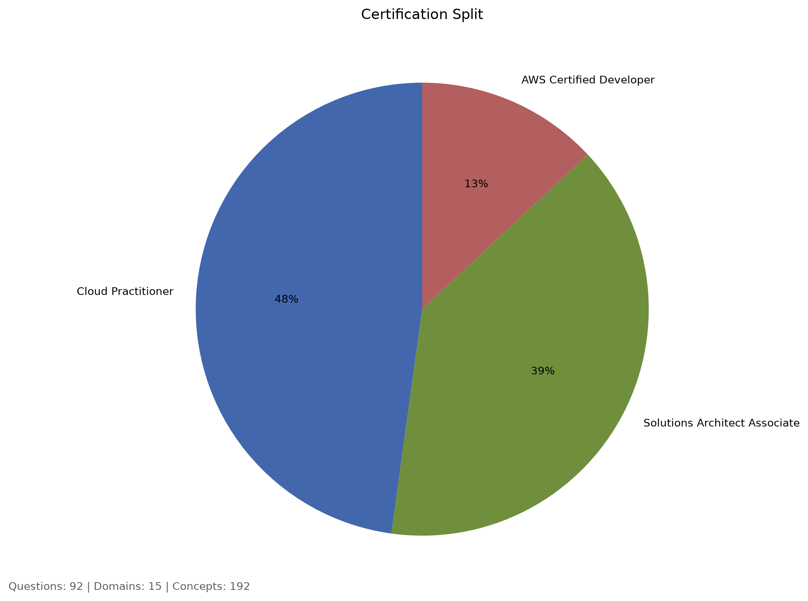
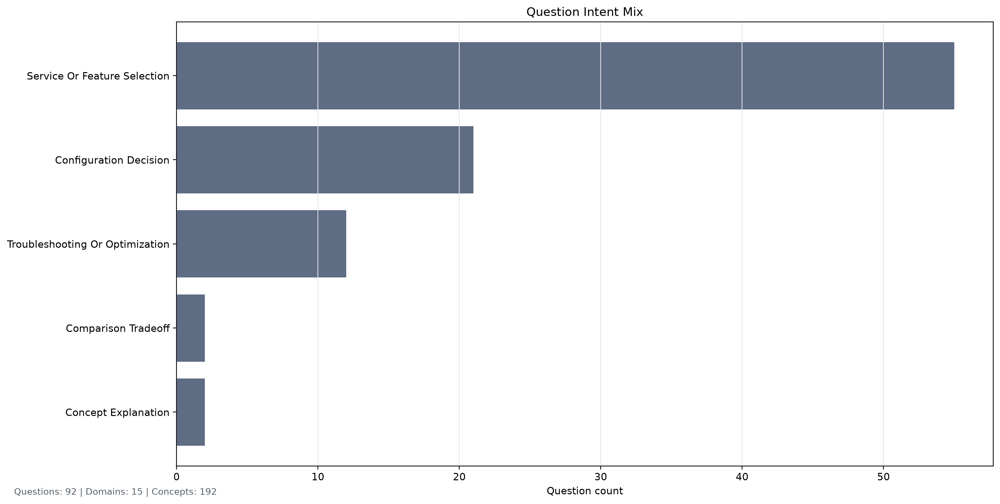

# Release Notes

| Release | Description                                                                                                                                                    |
| :------ | :------------------------------------------------------------------------------------------------------------------------------------------------------------- |
| v1.0.0  | Initial Streamlit/Docker release with generated AWS certification practice questions.                                                                          |
| v1.1.0  | Expands the question bank to 80 AWS-docs-grounded questions, and adds stricter wrong-service answer rejection.                                                 |
| v1.1.2  | Changed rating to grade and added feedback system.                                                                                                             |
| v1.1.3  | Gate feedback behind SHOW_FEEDBACK environmental variable.                                                                                                     |
| v1.3.4  | Swaps app scoring from trained regression to`semantic_similarity`.                                                                                             |
| v1.4.0  | v1.4.0 Cleaning up schema                                                                                                                                      |
| v1.4.1  | Accuracy went down after switching to long form answer format                                                                                                  |
| v1.4.3  | Include both long and short form answers in training data                                                                                                      |
| v1.4.4  | Switch back to long form answers in training data                                                                                                              |
| v1.5.0  | Updated accuracy release script to ensure consistent metrics                                                                                                   |
| v1.5.1  | Fix output of semantic metric chart, and move release metrics to folder with timestamps saved.                                                                 |
| v1.5.3  | Updated test data to have proper train, test, validation split                                                                                                 |
| v1.5.4  | Made`semantic_similarity` the official model name, moved release gating to 80% semantic precision.                                                             |
| v1.5.5  | Created automated deployment script                                                                                                                            |
| v2.1.1  | Adds Developer Associate freeform question generation and independent question-fidelity scoring.                                                               |
| v2.1.2  | Cleans Developer Associate question prompts, expands the Developer source set to 12 rows, generates 12 Developer questions, and adds v2 feedback text capture. |
| v2.2.0  | Designs service-comparison freeform questions, expanded source sampling, and a concept coverage chart for release notes.                                       |

# Release Metrics

| Release | Saved Accuracy | Training Accuracy | Semantic Accuracy | Semantic Precision | Semantic Recall | Question Fidelity |
| :------ | -------------: | ----------------: | ----------------: | -----------------: | --------------: | ----------------: |
| v1.5.0  |         96.00% |            68.00% |            68.00% |             84.62% |          68.75% |               N/A |
| v1.5.0  |         96.00% |            68.00% |            68.00% |             84.62% |          68.75% |               N/A |
| v1.5.3  |         96.00% |            68.00% |            68.00% |             84.62% |          68.75% |               N/A |
| v1.5.4  |         96.00% |            68.00% |            68.00% |             84.62% |          68.75% |               N/A |
| v2.1.1  |         96.00% |            68.00% |            68.00% |             84.62% |          68.75% |            96.80% |
| v2.1.2  |         93.33% |            63.33% |            83.33% |             90.00% |          90.00% |            96.00% |

For v2.1.1, the answer-scoring metrics are expected to match v1.5.4 because the generated answer benchmark and curated answer benchmark did not change. The regenerated Developer Associate question expansion is measured by the new Question Fidelity metric.

For v2.1.2, generated Developer Associate source questions remove multiple-choice-only instructions from freeform prompts. The Developer Associate source metadata expanded from 5 to 12 source rows and now produces 12 generated Developer questions in the app question set. Feedback submissions now capture the expected letter grade plus optional freeform grader context, and supplemental generated feedback rows cover question-rephrasing answers.
Developer questions use `AWS Certified Developer` as the display certification label and keep `DVA-C02` as internal exam-code metadata.

For v2.1.1 - v2.1.2,
I noticed a huge update to Semantic Accuracy and Semantic Recall after the latest update, but Training Accuracy is still in the 60s.
Also, I am worried about why Saved Accuracy is so much higher than Semantic Accuracy.

For v2.2.0 design planning, comparison-style freeform questions should ask learners to explain why the best service or feature beats the strongest near-miss distractor. The design is documented in [V2_2_ENHANCED_SERVICES_COMPARISON_DESIGN.md](V2_2_ENHANCED_SERVICES_COMPARISON_DESIGN.md). The release metrics run now generates domain, intent, and certification question coverage charts for the release notes.

### Scope

<!-- release-metrics:start -->
# Latest Release Metrics

| Release | Saved Model Accuracy | Training Accuracy | Semantic Accuracy | Semantic Precision | Semantic Recall | Question Fidelity |
|:--------|---------------------:|------------------:|------------------:|-------------------:|----------------:|------------------:|
| v2.2.1 | 96.15% | 61.54% | 73.08% | 88.24% | 78.95% | 96.00% |

Saved model answer form: `long`
Saved model calibration count: `21`
Question fidelity model: `question_fidelity_heuristic_v1`
Question fidelity sample count: `12`
Developer source question count: `12`
Developer generated question count: `12`
App question count: `92`
Question coverage domain count: `15`
Question coverage concept count: `192`
Question coverage intent count: `5`
Top covered concepts: `Amazon S3, cost optimization, Amazon RDS, replication, low latency, serverless, health checks, rules, AWS Organizations, SCPs, DynamoDB, Secrets Manager`
Semantic answer evaluation count: `26`

Training curve: `training_performance.png`
Curated grade-band accuracy (A/B, C/D, F): `curated_grade_accuracy.png`
`semantic_similarity` diagnostic chart: `semantic_accuracy.png`
Question intent coverage chart: `question_intent_coverage.png`
Certification coverage chart: `question_certification_coverage.png`
Curated failure analysis: `curated_failure_report.md`

Semantic precision is the release guardrail for the `semantic_similarity` model.
Question fidelity is the release guardrail for generated-question concept and exam-style fidelity.
Answer-scoring metrics come from the existing generated answer and curated answer benchmarks; question expansion quality is tracked separately by Question Fidelity.
Precision and recall treat A/B and C/D as accepted answers and F as rejected.

<!-- release-metrics:end -->
