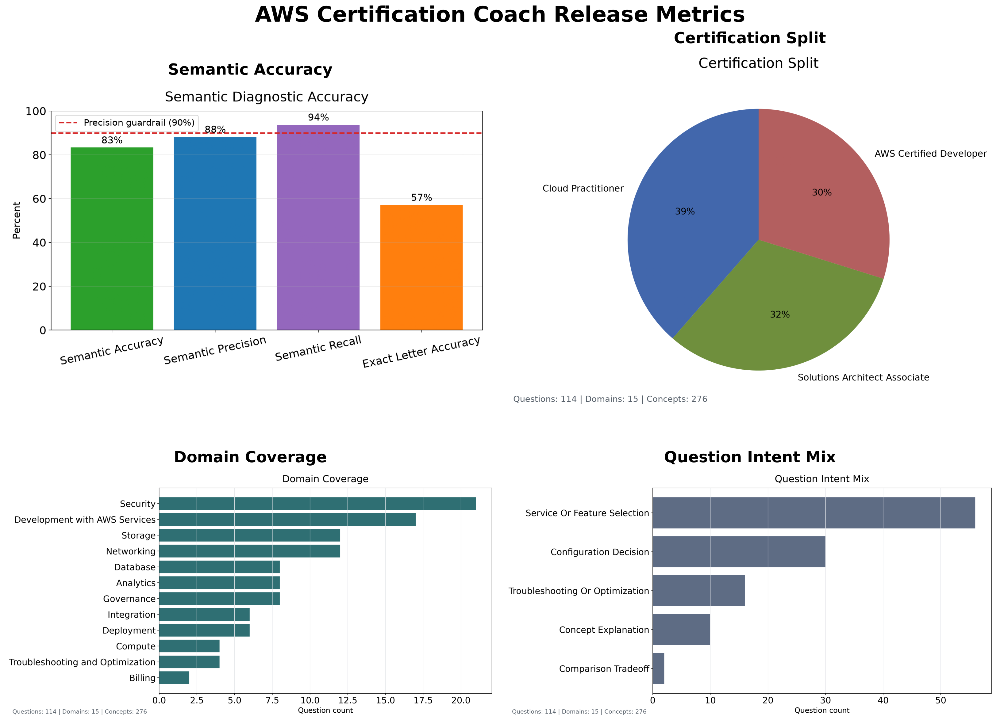

# Release Notes

| Release | Description                                                                                                                                                    |
| :------ | :------------------------------------------------------------------------------------------------------------------------------------------------------------- |
| v1.0.0  | Initial Streamlit/Docker release with generated AWS certification practice questions.                                                                          |
| v1.1.0  | Expands the question bank to 80 AWS-docs-grounded questions, and adds stricter wrong-service answer rejection.                                                 |
| v1.3.4  | Swaps app scoring from trained regression to`semantic_similarity`.                                                                                             |
| v1.4.4  | Switch back to long form answers in training data                                                                                                              |
| v1.5.5  | Created automated deployment script                                                                                                                            |
| v2.1.1  | Adds Developer Associate freeform question generation and independent question-fidelity scoring.                                                               |
| v2.1.2  | Cleans Developer Associate question prompts, expands the Developer source set to 12 rows, generates 12 Developer questions, and adds v2 feedback text capture. |
| v2.2.0  | Designs service-comparison freeform questions, expanded source sampling, and a concept coverage chart for release notes.                                       |
| v2.2.4  | Stabilizes answer grading against the standardized rubric and moves Training Accuracy out of the maintained release metrics table.                             |
| v2.3.0  | Release notes cleanup.                                                                                                                                         |
| v2.3.1  | Adds the app-facing answer rubric data contract, generated exact-letter grade examples, and strict grading release metrics flag.                               |

# Release Metrics

| Release | Semantic Accuracy | Semantic Precision | Semantic Recall | Question Fidelity |
| :------ | ----------------: | -----------------: | --------------: | ----------------: |
| v1.5.0  |            68.00% |             84.62% |          68.75% |               N/A |
| v1.5.4  |            68.00% |             84.62% |          68.75% |               N/A |
| v2.1.1  |            68.00% |             84.62% |          68.75% |            96.80% |
| v2.1.2  |            83.33% |             90.00% |          90.00% |            96.00% |
| v2.2.4  |            64.00% |             94.44% |          94.44% |            95.12% |
| v2.3.1  |            55.17% |             95.45% |          95.45% |            95.12% |

For v2.1.1, the answer-scoring metrics are expected to match v1.5.4 because the generated answer benchmark and curated answer benchmark did not change. The regenerated Developer Associate question expansion is measured by the new Question Fidelity metric.

For v2.1.2, generated Developer Associate source questions remove multiple-choice-only instructions from freeform prompts. The Developer Associate source metadata expanded from 5 to 12 source rows and now produces 12 generated Developer questions in the app question set. Feedback submissions now capture the expected letter grade plus optional freeform grader context, and supplemental generated feedback rows cover question-rephrasing answers.
Developer questions use `AWS Certified Developer` as the display certification label and keep `DVA-C02` as internal exam-code metadata.

For v2.1.1 - v2.1.2,
I noticed a huge update to Semantic Accuracy and Semantic Recall after the latest update, but Training Accuracy is still in the 60s.
Also, I am worried about why Saved Accuracy is so much higher than Semantic Accuracy.

For v2.2.0 design planning, comparison-style freeform questions should ask learners to explain why the best service or feature beats the strongest near-miss distractor. The design is documented in [V2_2_ENHANCED_SERVICES_COMPARISON_DESIGN.md](V2_ENHANCED_SERVICES_COMPARISON_DESIGN.md). The release metrics run now generates domain, intent, and certification question coverage charts for the release notes.

For v2.2.4, the maintained release metrics table is `Release`, `Semantic Accuracy`, `Semantic Precision`, `Semantic Recall`, and `Question Fidelity`.

`Training Accuracy` and `Saved Accuracy` have been removed from the release table because they no longer reflect the actual heuristic used in the app. `Semantic Accuracy`.

For v2.3.1, generated question artifacts now include `question_type`, rubric concept metadata, acceptable answers, misconception notes, and `must_not_claim` guardrails. The held-out exact-letter grade dataset is generated from the test split for rubric verification.
Strict grading release notes are enabled with `./release_notes.sh --full --strict-grading v2.3.1`; the exact-letter semantic accuracy is below the precision guardrail because several curated A/B/C boundary cases are intentionally counted as strict calibration misses.

### Current Coverage

<!-- release-metrics:start -->
# Latest Release Metrics

| Release | Semantic Accuracy | Semantic Precision | Semantic Recall | Question Fidelity |
|:--------|------------------:|-------------------:|----------------:|------------------:|
| v2.3.1 | 55.17% | 95.45% | 95.45% | 95.12% |

Saved model answer form: `long`
Saved model calibration count: `22`
Question fidelity model: `question_fidelity_heuristic_v1`
Developer source question count: `34`
App question count: `114`
Question coverage domain count: `15`
Question coverage concept count: `276`
Question coverage intent count: `5`
Top covered concepts: `rules, Amazon S3, cost optimization, Amazon RDS, replication, low latency, serverless, health checks, AWS Organizations, SCPs, DynamoDB, Secrets Manager`
Semantic answer evaluation count: `29`
Strict grading: `exact-letter`

Semantic precision is the release guardrail for the `semantic_similarity` model.
Question fidelity is the release guardrail for generated-question concept and exam-style fidelity.
Answer-scoring accuracy requires exact `A`, `B`, `C`, `D`, or `F` agreement; precision and recall remain accepted-answer diagnostics.
<!-- release-metrics:end -->
