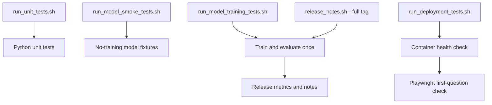

# Next-Version Test Suite Design

## Implementation Status

Version `v2.knowledgeBase1.2` implements the suite naming and isolation, fast read-only model smoke checks, explicit full model-training checks, single-training release orchestration, and the independent deployment suite using the existing Docker/HTTP test.

All tests are grouped under review-oriented directories: `application`, `artifacts`, `deployment`, `evaluation`, `knowledge`, `model_smoke`, `question_quality`, and `release`. Root-level `tests/test_*.py` files are rejected by a suite contract test.

The Playwright first-question guardrail remains planned for a later iteration. It is intentionally not a dependency or release requirement in `v2.knowledgeBase1.2`.

Version `v2.knowledgeBase1.3` makes `release_notes.sh --quick` a true no-training path. It validates and reuses a completed full metrics directory, then updates release-note Markdown and chart copies without running training, evaluation, coverage, unit, or smoke suites.

## Purpose

Restore clear test-suite boundaries by separating quick model sanity checks from full model training, and by moving container/browser deployment guardrails out of the unit suite.

The design covers two changes:

1. Split model testing into fast smoke validation and full training/evaluation.
2. Create an independent deployment suite with a Playwright check proving the first quiz question renders from the deployed container.

## Baseline Before v2.knowledgeBase1.2

- `run_unit_tests.sh` runs every file under `tests/`, including `test_docker_container.py`; the Docker test is skipped unless `RUN_DOCKER_TESTS=1`.
- `run_model_tests.sh` calls the `model` suite, which runs `scripts/model_evaluation.py` and performs the expensive model path.
- `release_notes.sh --full` runs the model suite and then performs release training and evaluation again.
- The deployment check verifies Streamlit health and inspects initial HTML, but it does not use a browser to prove that Streamlit completed its client-side rendering or that a quiz question is visible.
- `test_suites.py` advertises three suites (`unit`, `model`, and `release`), even though deployment is operationally a fourth boundary and model smoke versus model training are different workloads.

## Goals

- Give developers a model sanity command that completes quickly and fails on broken model loading, feature extraction, prediction, or knowledge-base access.
- Keep full model training, split evaluation, and quality gates available through an explicitly expensive command.
- Avoid repeating full training during a single release workflow.
- Keep Docker and browser dependencies out of ordinary unit tests.
- Prove that the built deployment reaches the learner-visible first question, not merely the Streamlit health endpoint.
- Preserve virtual-environment execution and local/offline model boundaries.

## Non-Goals

- Change model architecture, model weights, grading thresholds, or training data.
- Add broad visual-regression coverage of the Streamlit application.
- Test every quiz interaction in the deployment guardrail.
- Start the Streamlit application automatically during routine development or workspace startup.
- Replace focused Python tests with browser tests.

## Proposed Suite Contract

`test_suites.py` should expose these explicit suite names:

| Suite | Wrapper | Expected duration | Responsibility |
|:--|:--|:--|:--|
| `unit` | `run_unit_tests.sh` | Short | Pure Python behavior; excludes deployment tests. |
| `model-smoke` | `run_model_smoke_tests.sh` | Short | Load committed artifacts, score a small fixed fixture set, and validate stable output contracts without training. |
| `model-training` | `run_model_training_tests.sh` | Long | Train, evaluate splits, enforce model gates, and write ignored diagnostic artifacts. |
| `release` | `release_notes.sh --full <tag>` | Long | Orchestrate one full training run plus release metrics and notes. |
| `release-quick` | `release_notes.sh --quick <tag>` | Short | Reuse a complete full metrics directory and rerender notes/charts without training. |
| `deployment` | `run_deployment_tests.sh` | Medium | Run candidate-image health checks now; add the Playwright render guardrail in a later iteration. |

Do not retain `model` as an ambiguous permanent alias. A short transition alias may print a deprecation message, but automation should move to one of the two explicit model suites.

## Test Directory Layout

| Directory | Review scope |
|:--|:--|
| `tests/application/` | Streamlit-facing behavior, quiz sessions, and user feedback. |
| `tests/artifacts/` | Generated/curated artifact schemas, repositories, and split integrity. |
| `tests/deployment/` | Explicit candidate-image health checks; excluded from unit collection. |
| `tests/evaluation/` | Grade conversion and learner-answer evaluator behavior. |
| `tests/knowledge/` | Knowledge-base loading, validation, coverage, and retrieval. |
| `tests/model_smoke/` | Fast read-only production model contracts; excluded from unit collection. |
| `tests/question_quality/` | Question fidelity and service-comparison quality. |
| `tests/release/` | Release metrics, charts, histories, and suite-routing contracts. |

## Model Smoke Suite

The smoke suite must not call a training entry point. It should use committed/configured model artifacts and a small versioned fixture set to verify:

- model JSON loads successfully;
- feature names and weight counts agree;
- the configured knowledge base loads and validates;
- representative syntax aliases produce equivalent features;
- one clearly correct, partial, and incorrect answer can be scored;
- scores are finite, bounded, and convertible to A/B/C/D/F output;
- the configured evaluator factory can construct the production evaluator;
- no files are written under `models/`, `data/`, or `metrics/`.

The smoke fixtures should be purpose-built test fixtures, not the final verification split. Assertions should favor contracts and broad ordering (correct score greater than incorrect score) over fragile exact floating-point values unless an exact value is itself a compatibility contract.

Target duration: less than 10 seconds on a normal developer machine after environment setup.

## Full Model Training Suite

The full suite owns expensive model work:

- training from the configured training split;
- validation-based checkpoint selection;
- held-out and final test reporting without training leakage;
- semantic and exact-letter evaluation;
- model/knowledge compatibility checks;
- release guardrails and diagnostic reports.

The command should clearly announce that it performs training. Generated models and metrics must go to ignored timestamped directories unless an explicit release process copies reviewed artifacts.

`release_notes.sh --full` should call this training workflow once and reuse its outputs for release-note generation. It should not call a full model suite and then independently repeat the same training pipeline.

### Training Gate Versus Candidate Artifact

The project retains two explicit commands because they answer different questions:

- `run_model_training_tests.sh` is a quality gate. It trains temporary held-out regressors through `scripts/model_evaluation.py`, measures generalization and rubric behavior, and fails when configured quality thresholds are missed. It does not promote a candidate model.
- `train_accuracy_model.sh` is an artifact workflow. It trains one candidate regressor from the configured training and validation inputs and writes the model, metrics, charts, mismatch reports, and optional tagged detailed report under ignored/generated locations.

Run the training gate to validate model behavior. Run the artifact workflow when a new candidate model and its diagnostics are needed. Producing an artifact does not replace the training gate, and the smoke suite replaces neither command.

## Deployment Suite

Move `tests/test_docker_container.py` into a dedicated location such as:

`tests/deployment/test_docker_container.py`

Add Playwright coverage beside it, for example:

`tests/deployment/test_first_question.py`

The deployment wrapper should:

1. Require an explicit deploy-test flag or command invocation.
2. Accept `DOCKER_IMAGE`, or build the intended local image before testing when the caller requests it.
3. Start the container on a dynamically assigned loopback port.
4. Wait for `/_stcore/health` to return successfully.
5. Run the Playwright assertion against the same container.
6. Capture browser diagnostics on failure.
7. Stop the container in a guaranteed cleanup block.

The deployment suite must not be discovered by `run_unit_tests.sh`. It should be invoked explicitly by `run_deployment_tests.sh` and by the deployment/release guardrail that owns Docker availability.

## Playwright First-Question Guardrail

The browser test should navigate to the deployed root page and wait for Streamlit rendering to settle. It should assert learner-visible state rather than inspecting the bootstrap HTML.

Minimum assertions:

- the page displays the application title;
- the first quiz question text is visible and non-empty;
- the answer input control is visible and enabled;
- the answer submission control is visible;
- no Streamlit fatal-error panel is present.

Prefer stable accessibility selectors and explicit application labels. Avoid selectors based on generated CSS classes or DOM position. If the first question has no stable semantic locator, add a small stable test identifier or accessible label in a separate implementation change.

The test should stop after confirming the first question is ready. Answer submission, feedback rendering, navigation, and session behavior remain focused application-test concerns unless later deployment risks justify expanding the smoke path.

## Playwright Runtime

Keep browser dependencies isolated from production runtime dependencies. Recommended options, in order:

1. A development/test dependency group containing `pytest-playwright`, with the browser installed by the deployment setup command.
2. A dedicated test container that already contains the pinned Playwright browser runtime.

Pin compatible Python package and browser versions. The deployment wrapper should fail with an actionable setup message when Playwright or its browser binary is unavailable; ordinary unit and model-smoke suites should not require either dependency.

## Proposed Command Flow

## Migration Plan

### Phase 1: Name and Isolate Suites

- Add `model-smoke`, `model-training`, and `deployment` choices to `test_suites.py`.
- Add the three explicit wrapper scripts.
- Move deployment tests out of the unit-test discovery path.
- Keep the existing deployment health test behavior unchanged during the move.

### Phase 2: Add Fast Model Fixtures

- Extract non-training contract checks into the smoke suite.
- Prove the smoke command does not invoke training and does not write generated artifacts.
- Update routine developer documentation to use the smoke command.

### Phase 3: Remove Duplicate Release Training

- Make the full training suite return or persist a stable metrics directory.
- Make `release_notes.sh --full` consume that run rather than retraining.
- Keep release metrics and final verification separated from training inputs.

### Phase 4: Add Browser Deployment Guardrail

- Add isolated Playwright test dependencies.
- Add the first-question render test.
- Capture screenshot, page URL, console errors, and relevant container logs on failure.
- Add the deployment suite to the deployment guardrail after the image is built.

## Validation

Automated tests should prove:

- the unit suite excludes `tests/deployment/`;
- the model-smoke suite cannot call training functions;
- the smoke suite writes no model, data, or metrics artifacts;
- the model-training suite uses explicit train/validation/test inputs;
- the release flow performs one full training run;
- the deployment suite always cleans up its container;
- the Playwright test fails when the question is absent even if the health endpoint is healthy;
- browser diagnostics are retained on deployment failure;
- all Python commands run through `.venv/bin/python` or an existing project wrapper.

## Release and CI Policy

- Pull-request routine checks: unit plus model smoke.
- Model-changing pull requests: unit, model smoke, and full model training.
- Image/deployment guardrail: deployment suite against the exact candidate image.
- Full release: one model-training run, release metrics, and deployment suite before approval.
- Docker images and release tags remain manual-review actions.

## Acceptance Criteria

- Developers can run a fast model sanity command without training.
- Full training has an unmistakable command name and remains a release gate.
- A full release does not train the same model twice.
- Deployment tests are absent from an ordinary unit-test collection.
- The deployment suite verifies both container health and browser-rendered first-question visibility.
- Playwright dependencies do not enter the production application image unless explicitly justified.
- Failure output is enough to diagnose browser, Streamlit, or container startup problems.
