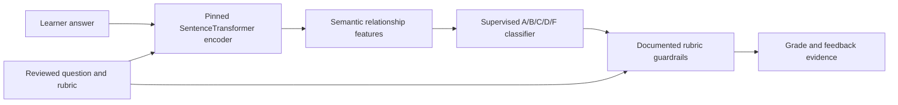
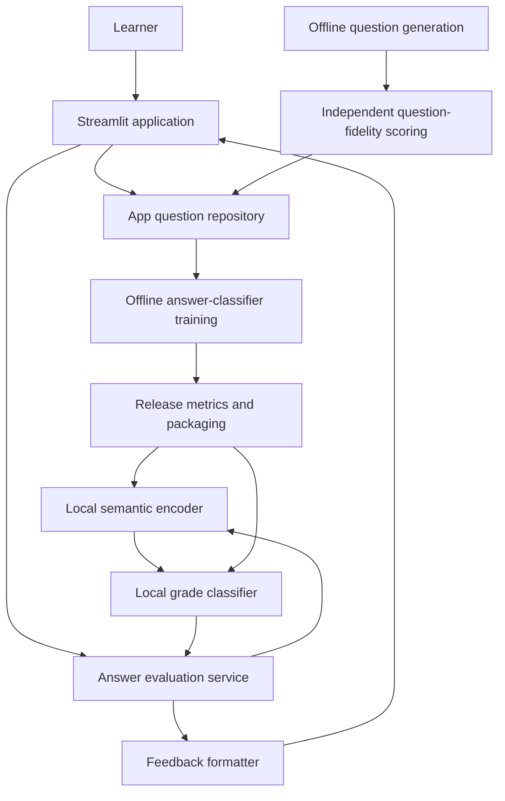
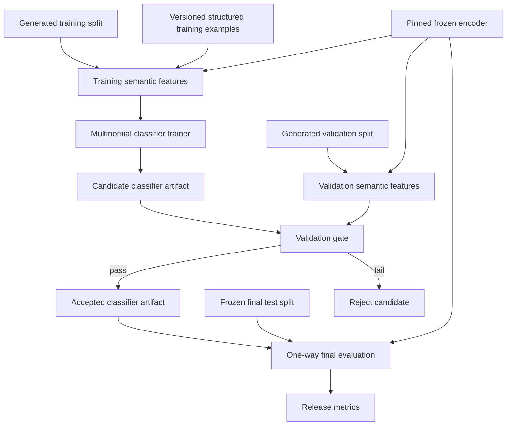
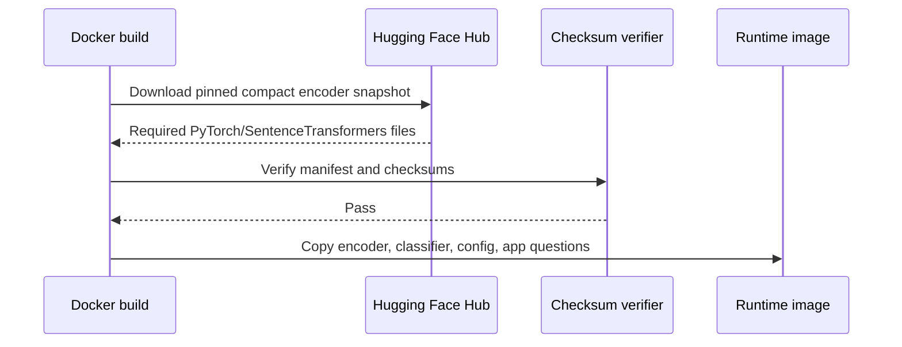
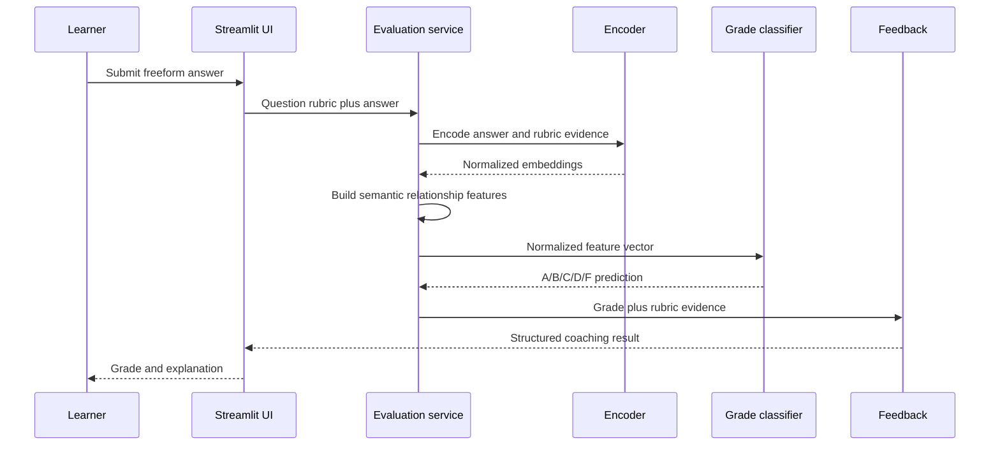
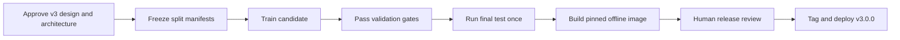

# v3.0.0 Local Semantic Answer Grading Architecture

Status: Proposed  
Target release: `v3.0.0`  
Companion documents: `docs/V3_LOCAL_SEMANTIC_ANSWER_GRADING_DESIGN.md`, `docs/V3_LOCAL_SEMANTIC_ANSWER_GRADING_METRICS.md`

## Architecture Overview

Version 3 uses a local semantic encoder followed by a supervised letter-grade classifier. Question generation and question-fidelity scoring remain offline systems with independent artifacts.



The runtime does not train models, download model files, read training labels, or call an external inference API.

## System Context



## Runtime Components

### Streamlit Application

Responsibilities:

- Load reviewed app-facing questions.
- Manage quiz session state.
- Accept learner answers.
- Call the answer evaluation service.
- Display the assigned grade and coaching feedback.
- Cache model-backed services as resources.

The UI must not know how embeddings or classifier coefficients are implemented.

### Answer Evaluation Service

The evaluation service is the stable boundary between the application and grading implementations.

Input:

- Question and rubric metadata.
- Learner answer.

Output:

- Numeric display score mapped from A/B/C/D/F.
- Missing concepts.
- Suggested improvements.
- Learner-facing feedback.
- Detailed reference answer.
- Evaluator identity for diagnostics.

The service must return a controlled error when required artifacts are absent or incompatible.

### SentenceTransformer Provider

The provider owns:

- Device selection.
- Encoder loading.
- Feature-contract loading.
- Classifier loading.
- Semantic feature extraction.
- Grade prediction.
- Documented deterministic rubric guardrails.
- Conversion into the evaluation response contract.

The provider does not own training or final-test evaluation.

### Semantic Encoder

Model family: SentenceTransformers  
Initial model: `sentence-transformers/all-MiniLM-L6-v2`  
Output: normalized 384-dimensional embeddings

Device resolution:

1. If `AWS_COACH_CPU_ONLY=1`, use CPU.
2. If an explicit device is configured, use it.
3. Otherwise allow SentenceTransformers to select an available accelerator or CPU.

The Docker image sets `AWS_COACH_CPU_ONLY=1`.

### Feature Extractor

The feature extractor converts variable learner text into a stable, low-dimensional relationship vector.

Feature groups:

- Learner versus reference-answer similarity.
- Learner versus acceptable-answer similarity.
- Learner versus required-concept coverage.
- Learner versus misconception or prohibited-claim similarity.
- Correct-versus-incorrect semantic margin.
- Bounded length ratio.
- Exact normalized acceptable-answer indicator.

The feature vector is model-neutral with respect to individual AWS service identities. It must not include final-test labels or question-specific grade lookup keys.

### Grade Classifier

The classifier is a class-balanced multinomial logistic model trained on semantic relationship features.

Runtime operations:

1. Verify the classifier `feature_version` matches the extractor.
2. Normalize features with saved means and scales.
3. Compute class logits.
4. Select one of `A`, `B`, `C`, `D`, or `F`.
5. Map the class to the stable display score.

The classifier artifact is JSON so its parameters and metadata can be inspected without executing arbitrary serialized code.

### Feedback Formatter

The classifier predicts a grade; it does not generate prose. The feedback layer uses question rubric metadata and deterministic templates to produce:

- Correct concepts.
- Missing concepts.
- Misconceptions.
- Improvement suggestions.
- Detailed reference answer.

Future versions may add a separate local feedback-generation component, but it must not silently alter the classifier grade.

## Offline Training Architecture



Final test data has no path back into training, feature selection, or candidate selection.

## Data And Artifact Boundaries

| Category | Intended location | Versioned | Runtime-readable | Training-readable |
|:---------|:------------------|:---------:|:----------------:|:-----------------:|
| Structured supervised source | `config/data/structured_answer_training_data.json` | Yes | No | Training only |
| Generated training split | `data/generated/questions_with_answers_training.json` | No | No | Yes |
| Generated validation split | `data/generated/questions_with_answers_validation.json` | No | No | Validation only |
| Frozen final test split | `data/generated/questions_with_answers_test.json` | No | No | Final evaluator only |
| App questions | `data/questions/sample_questions.json` | No | Yes | Metadata only when explicitly configured |
| Encoder manifest | `config/models/answer_encoder_manifest.json` | Yes | Build only | Build only |
| Encoder files | `models/huggingface/<model>/` | No; verified build artifact | Yes | Yes |
| Classifier artifact | `models/answer_semantic_classifier.json` | Yes | Yes | Output only |
| Generated metrics | `metrics/<timestamp>/` | No | No | No |

No runtime component may load generated labels, structured training rows, or final test rows.

## Classifier Artifact Contract

The classifier artifact schema must include:

```json
{
  "artifact_schema_version": 1,
  "model_name": "semantic_grade_classifier_v1",
  "feature_version": "semantic-relations-v2",
  "classes": ["A", "B", "C", "D", "F"],
  "coefficients": [],
  "intercepts": [],
  "means": [],
  "scales": [],
  "encoder": {
    "repository": "sentence-transformers/all-MiniLM-L6-v2",
    "revision": "<pinned-hugging-face-revision>",
    "embedding_dimension": 384
  },
  "training_manifest": {
    "training_hash": "<sha256>",
    "structured_training_hash": "<sha256>",
    "validation_hash": "<sha256>"
  },
  "validation_metrics": {
    "exact_letter_accuracy": 0.0
  }
}
```

Loading fails when:

- The schema version is unsupported.
- The feature version differs from the extractor.
- The encoder identity differs from the packaged encoder.
- Feature dimensions differ from saved coefficients.
- Required provenance fields are missing.

## Model Distribution And Container Build

The production image must be buildable from a clean clone.

Preferred build flow:



The runtime container must not download model files. Downloading during the build is acceptable only when the revision and checksums are pinned. Offline or hermetic builds may instead consume a versioned model bundle produced by the release workflow.

The model bundle excludes unused ONNX, OpenVINO, TensorFlow, and training-only files.

## Runtime Sequence



## Configuration

Required evaluator configuration:

- Provider: local semantic classifier.
- Encoder path.
- Classifier artifact path.
- Device mode.
- CPU-only override.

Environment overrides:

- `AWS_COACH_LOCAL_MODEL_PATH`
- `AWS_COACH_LOCAL_CLASSIFIER_PATH`
- `AWS_COACH_LOCAL_MODEL_DEVICE`
- `AWS_COACH_CPU_ONLY`

Production configuration must not include an OpenAI API key requirement for answer grading.

## Failure Handling

Startup failures:

- Missing encoder.
- Missing classifier artifact.
- Unsupported artifact schema.
- Encoder or feature-version mismatch.
- Unsupported device selection.

Evaluation failures:

- Invalid embedding dimensions.
- Non-finite feature values.
- Unknown classifier label.
- Malformed question rubric metadata.

Failures must be logged without learner-answer contents unless explicit feedback collection is enabled. The UI should display a controlled grading-unavailable message and preserve the learner answer in session state for retry.

There is no silent fallback to legacy grading in the v3 production configuration.

## Security And Privacy

- Learner answers remain local to the application process unless the learner explicitly submits feedback.
- Runtime grading makes no external network request.
- Model downloads occur during controlled preparation or image build, not learner sessions.
- Downloaded files are verified before packaging.
- Model licenses and notices are included in the release image and repository documentation.
- Serialized executable model formats are avoided for the classifier head.

## Observability

Allowed runtime diagnostics:

- Evaluator name and artifact version.
- Device type.
- Model-load duration.
- Evaluation duration.
- Predicted grade.
- Controlled error category.

Learner-answer text must not be logged by default.

Release diagnostics include split counts, data hashes, confusion matrices, per-grade metrics, domain metrics, and CPU latency.

## Test Architecture

### Unit Tests

- Device resolution and CPU override.
- Feature-vector stability.
- Classifier artifact round trip.
- Feature-version and dimension rejection.
- Grade-to-score mapping.
- Exact acceptable-answer and misconception guardrails.
- Controlled missing-artifact errors.

### Split Integrity Tests

- Training defaults exclude final test paths.
- Validation defaults exclude final test paths.
- Question-family signatures do not overlap across splits.
- Structured training examples do not appear in final test.
- Final evaluator does not import training functions.

### Model Tests

- Validation within-one-letter gate above 90%.
- Final-test within-one-letter gate above 90%.
- Per-grade precision and recall.
- Confusion matrix stability.
- Paraphrase invariance cases.
- Wrong-service and severe-misconception rejection.
- CPU latency and memory smoke tests.

### Container Tests

- Build from a clean clone.
- Start with network disabled.
- Confirm CPU-only device selection.
- Load both encoder and classifier.
- Grade one correct and one incorrect smoke-test answer.
- Confirm health endpoint remains responsive.

## Release Flow



Version 3.0.0 is blocked if any required gate fails. A waiver must name the failed metric, user impact, mitigation, and follow-up release; final-test exact-letter accuracy below 90% is not eligible for an undocumented waiver.

## Legacy Boundaries

Historical `trained_classifier`, `trained_regressor`, and `semantic_similarity` implementations may remain temporarily for migration tests. They are outside the v3 production path.

Legacy metrics must be labeled by evaluator and cannot occupy the v3 headline accuracy field. Exact question-and-answer calibration maps are not part of the v3 classifier artifact or runtime path.

## Architecture Acceptance Criteria

- Runtime dependency graph contains the encoder and classifier but no hosted grading client.
- Training, validation, and final evaluation are separate commands and data paths.
- The classifier artifact identifies its encoder, features, data manifests, and validation result.
- Production image builds from a clean clone with pinned artifacts.
- Production inference is CPU-only and offline.
- Final-test within-one-letter accuracy is greater than 90%.
- Release metrics and documentation name the same evaluator and artifact versions.
- Learner-answer grading and question-fidelity scoring remain operationally independent.
